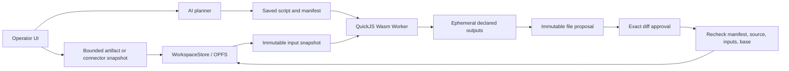

# WasmHatch

> Browser-native AI operations with explicit effects.

[Open the business-operator foundation slice](https://haya-inc.github.io/wasmhatch/?view=operator)

[Run the 60-second local demo](https://haya-inc.github.io/wasmhatch/?view=operator&demo=local) — no account, API key, OAuth, upload, or server required.

[Try invoice reconciliation](https://haya-inc.github.io/wasmhatch/?view=operator&demo=reconciliation) — compare synthetic ERP and payout values, then review seven derived cells.

[Start with your CSV/XLSX](https://haya-inc.github.io/wasmhatch/?view=operator&start=upload) — opens the local, Worker-isolated import path directly.

WasmHatch is an open-source, browser-native AI operator for general business
work. It gives an AI typed access to spreadsheets and future business APIs,
runs generated data transformations inside a resource-limited Wasm sandbox,
and stops external writes for an explicit effect review.

The initial product is foreground-only: the user keeps the tab open, credentials
remain in a host broker outside connector, model, and script code, and every
write requires approval. Background
schedules, refresh-token storage, webhooks, and non-CORS APIs belong to an
optional future server adapter rather than the static application.

The foundation slice now ships:

- versioned local and Google Sheets connector manifests with strict core
  compatibility, operation, origin, resource, media-type, and size boundaries;
- a credential broker that validates unsigned connector requests before adding
  authorization, without exposing token text to connector code;
- Google Identity Services foreground OAuth with short-lived, memory-only
  Sheets credentials, explicit reauthorization, and grant revocation;
- Worker-isolated CSV/XLSX import with ZIP/XML/shape limits, SHA-256 provenance,
  visible-sheet selection, macro rejection, and normalized JSON persistence;
- a key-free bundled CSV that exercises the production import Worker, workspace
  snapshot, QuickJS transform, typed review, and safe export path before users
  bring an authorized file;
- safe CSV and value-only XLSX export that never emits source formulas, macros,
  external links, or hidden workbook payloads;
- an optional OpenAI Responses API planner that turns a business instruction
  and visible rows into a strict, reviewable transformation proposal;
- an optional, feature-detected Chrome built-in AI planner that can stage one
  active-table transform without an API key on compatible desktop devices;
- QuickJS compiled to Wasm and executed in a Web Worker;
- CPU, memory, source, input, and output limits;
- spreadsheet-shaped JSON transformations with no `fetch`, DOM, or host access;
- saved JavaScript and versioned manifests with exact workspace input/output
  grants;
- an ephemeral snapshot VFS inside QuickJS: scripts never receive live OPFS,
  OAuth credentials, connector handles, or ambient network access;
- immutable workspace-file proposals that recheck the manifest, source, every
  input, and output base before an approved diff is written;
- an Operator-only OPFS namespace plus a bounded portable workspace ZIP whose
  restore and clear proposals bind the exact archive/current file identities,
  recheck before replacement, verify every result, and roll back proven failures;
- a thin artifact browser that validates and hashes workspace text files,
  previews at most 24 KB / 200 lines locally, and records one explicit,
  identity-bound AI attachment before any checkpointed model read;
- a typed artifact workflow mode that stages one Markdown/CSV/JSON/text/JavaScript
  output, derives its manifest authority on the host, runs against copied inputs
  in QuickJS, and stops at an exact file diff;
- a checkpointed OpenAI workspace loop that lists, searches, and reads only
  exact local artifact grants or one foreground-loaded Google Sheets target,
  records model egress, enforces request/token/tool budgets, and stops at a
  reviewable script proposal;
- a shared run journal and policy-decision envelope that joins model/tool events,
  scripts, proposals, reviews, conflicts, receipts, and pilot timing metrics in
  an explicit credential-field-free, defensively redacted JSON export;
- a public pilot-report action for committed or safely rejected guided,
  CSV/XLSX, and foreground Google Sheets proposals that copies aggregate counts
  and timings while excluding source contents, task text, resource identities,
  and run ID;
- two deterministic, key-free pilot paths for pipeline normalization and invoice
  reconciliation, both using the production sandbox and effect-review protocol;
- typed cell-mutation bundles that generate preview, summary, commit payload,
  and inverse receipt metadata from one immutable source;
- receipt-bound undo/redo for the most recent approved local table effect in
  the active session, staged as a new exact cell proposal with another review,
  source recheck, approval, and verified `work/` snapshot;
- explicit rejection of structural changes and ungranted formula writes;
- cell-level write previews with explicit approve/reject controls; and
- a per-tab structured audit trail for reads, scripts, and writes.

The current operator accepts local CSV/XLSX files, a Google OAuth Web client ID
as public session configuration, and an optional memory-only OpenAI API key.
Compatible Chrome desktops can instead process the current task and table with
the browser's built-in model; Chrome may download model files, but the business
input stays on the device. This local adapter does not handle workspace
attachments or artifact-output plans.
Google Sheets now enters the checkpointed artifact-workflow loop through one
exact foreground read grant. The broker materializes a credential-free,
content-addressed workspace snapshot without letting model output select a
provider resource or authorize an effect.

See the current [product plan](docs/plan.md), [connector authoring
guide](docs/connector-authoring.md), [tabular mutation
contract](docs/tabular-mutations.md), [Google OAuth deployment
guide](docs/google-oauth.md), [CSV/XLSX artifact
boundary](docs/tabular-artifacts.md), [Chrome built-in AI planner
boundary](docs/chrome-built-in-ai.md), [workspace script and file-effect
contract](docs/workspace-scripts.md), [checkpointed workspace agent
loop](docs/workspace-agent-loop.md), [run journal and policy decision
contract](docs/run-journal.md), [Operator workspace portability and recovery
contract](docs/operator-workspace-portability.md), [Operator artifact browser
and AI attachment contract](docs/operator-artifact-browser.md), [typed workspace
artifact workflow contract](docs/workspace-artifact-workflows.md), [Google Sheets
workspace snapshot contract](docs/google-sheets-workspace-snapshots.md), and [business-agent
landscape](docs/landscape.md).

New users can start with a [real local CSV/XLSX
workflow](https://haya-inc.github.io/wasmhatch/?view=operator&start=upload) or
the [quickstart](docs/quickstart.md). It covers the key-free local review loop,
local CSV/XLSX files, and the exact Google Sheets snapshot-to-artifact path.

For pilots, use the [business pilot and OSS adoption
playbook](docs/launch-playbook.md) and copy the [pilot evidence
template](docs/pilot-evidence-template.md) into the approved internal system.
Public, sanitized workflow reports can be shared in [business operator pilot
registry issue #12](https://github.com/haya-inc/wasmhatch/issues/12).

## Legacy coding workspace

The earlier issue-to-patch coding workspace remains available at
`?view=workspace` during migration. The sections below document that legacy
surface and are retained so its existing users and in-progress changes are not
disrupted. It is no longer the product direction.

## Try it locally

Requirements: Node.js 20 or newer and a current desktop browser.

```bash
npm install
npm run dev
```

Open the URL printed by Vite. Use **Hatch a sample** to enter the workspace,
then run **Local demo**. An Anthropic API key is optional and is kept only in
the current tab's memory.

```bash
npm test
npm run build
```

## Add an Open in WasmHatch link

The project page includes a URL and badge builder. It accepts `repo`, optional
`ref`, `task`, and optional `issue` query parameters, prefills the repository
revision and task, and leaves the visitor in control of starting the import.

```markdown
[](https://haya-inc.github.io/wasmhatch/?view=workspace&repo=OWNER/REPOSITORY&ref=BRANCH_OR_TAG&task=DESCRIBE%20A%20SMALL%20CHANGE&issue=https%3A%2F%2Fgithub.com%2FOWNER%2FREPOSITORY%2Fissues%2F123)
```

Encode the task as a URL query value and keep it focused enough to review as one
patch. When supplied, `issue` must be a canonical public GitHub Issue URL; it is
kept visible through patch export so contributors can return to the acceptance
criteria and submission thread. Automatic repository fetching is intentionally
not triggered by merely opening a link.

## Current contributor lanes

New contributions should improve the Business Operator and its bounded
source-to-review loop. Current newcomer-sized tasks are:

- [focus the exact effect review from the guided flow](https://github.com/haya-inc/wasmhatch/issues/13);
- [fail closed when a guided sample's mutation count drifts](https://github.com/haya-inc/wasmhatch/issues/14).

Read and claim an issue before editing. Public product evidence belongs in the
[Business Operator pilot registry](https://github.com/haya-inc/wasmhatch/issues/12),
including safely rejected or blocked workflows. The former coding-workspace
adoption registry and its unclaimed good-first issues are archived; their history
remains available, but they are not the current roadmap.

See the source-backed [product landscape and decision guide](docs/landscape.md).

## Legacy patch export

WasmHatch records a separate baseline whenever a sample, GitHub repository, or
zip archive is imported. Manual and agent-approved edits change only the working
tree. Use **Patch** in the workspace header to download the difference as
`wasmhatch.patch`:

```bash
git apply --check wasmhatch.patch
git apply wasmhatch.patch
```

The baseline is stored separately in OPFS and survives reload. The patch can
represent modified, added, and removed text files; the current UI does not yet
expose file deletion.

## Current capability matrix

Rows about repository import, patch handoff, and the Anthropic agent describe the
retained legacy route. The Business Operator rows are the canonical product.

| Capability | Status |
| --- | --- |
| Business-operator runtime | React UI; QuickJS Wasm script Worker; CSV/XLSX codec Worker |
| Natural-language table planning | Chrome built-in AI on compatible desktops without an API key, or OpenAI Responses with a memory-only session key |
| CSV/XLSX artifact boundary | Available, value-only with immutable input provenance, verified approved `work/` snapshots, reviewed session undo/redo, and safe export |
| Manifest-bound workspace scripts | Available for imported tabular snapshots |
| Snapshot virtual filesystem | Available; exact inputs and ephemeral outputs only |
| Workspace file-diff approval | Available; manifest/source/input/base recheck before write |
| Checkpointed workspace AI tools | Available for exact local artifact grants and one foreground-loaded Google Sheets target |
| Model-egress and agent budgets | Available for list/read/search/tabular/Google Sheets planning loops |
| Structured run journal | Available as an explicit credential-field-free, defensively redacted JSON export with derived pilot metrics |
| Public pilot feedback | Available as a source-free aggregate Markdown summary plus a privacy-confirming GitHub Issue Form |
| Operator workspace export/restore | Available as a bounded text-only ZIP with exact restore/clear review, stale-base rejection, verification, and rollback |
| Operator artifact browser | Available with validated metadata, bounded local text preview, and one explicit SHA-256-bound AI attachment |
| Typed workspace artifact workflow | Available for one host-manifested Markdown/CSV/JSON/text/inert-JavaScript output through QuickJS and exact file-diff approval |
| Google Sheets snapshot-to-artifact workflow | Available as one zero-argument exact connector read, credential-free content-addressed OPFS input, bounded model preview, QuickJS run, and approved output diff |
| OPFS workspace with localStorage fallback | Available |
| Public GitHub repository import | Available, text files up to documented limits |
| Zip import and export | Available |
| Manual editing and persistence | Available |
| Persistent import baseline and unified patch export | Available |
| Storage usage, workspace clearing, and export-before-delete | Available |
| OPFS fallback and browser durability diagnostics | Available |
| Review-before-write agent proposals | Available |
| Anthropic Messages API tool loop | Alpha, BYOK |
| Validated, cancellable, single-proposal agent runs | Available |
| Protected credential paths and visible model-egress ledger | Available |
| 200-line/50 KB file ranges, conversation compaction, and run budgets | Available |
| Strict production meta CSP and build-time policy verification | Available |
| Pre-inflation zip limits and deterministic malformed-archive regression tests | Available |
| Keyboard-contained storage dialog with Escape and focus restoration | Available |
| Share URL and badge builder | Available |
| Shareable `repo`, `ref`, `task`, and GitHub `issue` context | Available |
| Revision-pinned real task examples | Available |
| Share-ready Open Graph and large-card preview | Available |
| Local-directory write-back | Planned |
| Permissioned command runtime | Planned for the Claude Code-like path; adapter not selected |
| Wasm/WASI execution | Planned for selected portable CLI utilities, not as an OS substitute |
| Git commit and pull-request creation | Planned |

## Trust model

Local-first does not mean secret or offline.

- Workspace files remain in browser-managed storage until an explicit import,
  export, or model tool result sends data elsewhere.
- **Manage browser storage** reports the working tree and baseline separately.
  Clearing removes both; **Export zip & clear** includes an unsaved current edit
  before removing the stored copies.
- The model receives only tool-requested file content, but that content does
  leave the device and is governed by the selected provider's terms.
- The agent omits common credential paths such as `.env*`, private keys, and
  cloud credential directories from file lists and rejects reads or proposals
  targeting them. This is a path-based heuristic, not secret-content scanning.
- The workspace ledger shows task text, file lists, and file reads attached to
  model requests, including their byte sizes. It does not include the static
  system prompt or API key; the key is sent only as the provider authorization header.
- Agent history keeps the initial task and two recent completed tool exchanges;
  older exchanges become a content-free tool summary and can be re-read by range.
- Each run stops at 8 requests, 500 KB of cumulative serialized request bodies,
  120,000 provider-reported input tokens, or 8,000 output tokens. These are
  safety limits rather than a currency estimate; provider pricing still varies.
- The production meta CSP denies all sources by default and allowlists only this
  origin, GitHub API/raw content, and Anthropic API connections. GitHub Pages
  does not support project-defined response headers, so header-only controls
  such as `frame-ancestors` are not claimed by the current deployment.
- The Anthropic key is not persisted. A browser application cannot turn an API
  key into a perfectly isolated secret, so use a dedicated key with a spending
  limit and revoke it after testing.
- Imported archives are limited to 20 MB, 500 text files, and 2 MB per file.
- Local tabular imports are limited to 8 MB compressed, 32 MB declared XLSX
  expansion, 64 worksheets, 5,000 rows, 200 columns, and 200,000 cells.
- Workspace scripts persist source and manifest files, but run only against copied
  input snapshots. Their virtual filesystem has no live OPFS, DOM, network,
  connector, credential, or model authority.
- Workspace output remains transient until its exact unified diff is approved.
  Commit rechecks the manifest, source, every input, and output base; conflicts
  write nothing, while ambiguous writes require reconciliation.
- The workspace planner begins with task text and exact grant counts rather than
  the whole artifact. Every tool result sent to OpenAI records its path, source
  hash, and byte count. Six-request, six-tool, token, request-byte, and egress
  limits stop before further workspace reads when exceeded.
- ZIP metadata is checked before inflation for unsafe paths, duplicate normalized
  paths, excessive file counts, and more than 20 MB of accepted expanded content.
- Paths are normalized and traversal outside the workspace is rejected.
- Command execution is deliberately absent until runtime licensing, network
  egress, and secret-file handling are proven.

Read the full [project plan](docs/plan.md) and [security policy](SECURITY.md).

## Architecture



The sandbox is intentionally smaller than a browser command runtime. It executes
bounded data transforms without a proprietary or vendor-hosted container and
without exposing the host workspace as a general filesystem.

## Contributing

Small, reviewable contributions are welcome. Start with
[CONTRIBUTING.md](CONTRIBUTING.md), run the test and build commands, and explain
the user-visible outcome in your pull request.

High-value areas include:

- browser filesystem contract tests;
- accessible keyboard workflows;
- safer archive and repository import;
- deterministic agent fixtures;
- an embeddable **Open in WasmHatch** link;
- runtime research with explicit license and security boundaries.

## License

Apache-2.0. WasmHatch is not affiliated with Anthropic, Claude, StackBlitz, or
GitHub.
