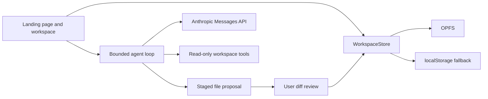

# WasmHatch

> Browser-native AI operations with explicit effects.

[Open the business-operator foundation slice](https://haya-inc.github.io/wasmhatch/?view=operator)

WasmHatch is an open-source, browser-native AI operator for general business
work. It gives an AI typed access to spreadsheets and future business APIs,
runs generated data transformations inside a resource-limited Wasm sandbox,
and stops external writes for an explicit effect review.

The initial product is foreground-only: the user keeps the tab open, credentials
remain in connector memory, and every write requires approval. Background
schedules, refresh-token storage, webhooks, and non-CORS APIs belong to an
optional future server adapter rather than the static application.

The foundation slice now ships:

- a Google Sheets value-range connector with credentials isolated from scripts;
- QuickJS compiled to Wasm and executed in a Web Worker;
- CPU, memory, source, input, and output limits;
- spreadsheet-shaped JSON transformations with no `fetch`, DOM, or host access;
- cell-level write previews with explicit approve/reject controls; and
- a per-tab audit trail for reads, scripts, and writes.

Google OAuth UI and the business AI planner are the next milestones. The current
operator accepts a development access token for connector testing and clearly
labels that limitation.

See the current [product plan](docs/plan.md) and [business-agent landscape](docs/landscape.md).

## Legacy coding workspace

The earlier issue-to-patch coding workspace remains available at
`?view=workspace` during migration. The sections below document that legacy
surface and are retained so its existing users and in-progress changes are not
disrupted. It is no longer the product direction.

## Try it locally

Requirements: Node.js 20 or newer and a current desktop browser.

```bash
npm install
npm run dev
```

Open the URL printed by Vite. Use **Hatch a sample** to enter the workspace,
then run **Local demo**. An Anthropic API key is optional and is kept only in
the current tab's memory.

```bash
npm test
npm run build
```

## Add an Open in WasmHatch link

The project page includes a URL and badge builder. It accepts `repo`, optional
`ref`, `task`, and optional `issue` query parameters, prefills the repository
revision and task, and leaves the visitor in control of starting the import.

```markdown
[](https://haya-inc.github.io/wasmhatch/?view=workspace&repo=OWNER/REPOSITORY&ref=BRANCH_OR_TAG&task=DESCRIBE%20A%20SMALL%20CHANGE&issue=https%3A%2F%2Fgithub.com%2FOWNER%2FREPOSITORY%2Fissues%2F123)
```

Encode the task as a URL query value and keep it focused enough to review as one
patch. When supplied, `issue` must be a canonical public GitHub Issue URL; it is
kept visible through patch export so contributors can return to the acceptance
criteria and submission thread. Automatic repository fetching is intentionally
not triggered by merely opening a link.

## Try a real task

The [Examples section](https://haya-inc.github.io/wasmhatch/#examples) contains
three small tasks against exact public commits:

- make [patch and zip filenames repository-aware](https://github.com/haya-inc/wasmhatch/issues/11), published as a `good first issue`;
- add network-free CLI smoke tests to `create-knowledge-kit`;
- establish the first test baseline for `create-wiki-kit`.

Each task is sized for one reviewable patch and opens with the repository,
revision, and task already filled in. These are real repositories rather than
tutorial fixtures.

## Pick a contribution

The project page has a [contributor opportunity board](https://haya-inc.github.io/wasmhatch/#contribute)
with five independent, revision-pinned `good first issue` lanes. Read and claim
an issue before editing, then open the task directly in WasmHatch. Current lanes
cover parsing, security UX, editor UX, import provenance, and accessibility.

## Share an adoption

WasmHatch does not use third-party analytics. If you trial the workflow on an
external public repository or publish a task link or badge, add it to the
[opt-in adoption registry](https://github.com/haya-inc/wasmhatch/issues/9).
Include time-to-first-diff and whether export was reached when possible. Reports
that expose friction or failed trials are as useful as successful ones.

## Where WasmHatch fits

WasmHatch starts with a runtime-free path for a small public issue that can be
reviewed as a text patch. That focused workflow is the adoption wedge, not the
limit of the architecture. The longer-term goal is a permissioned browser coding
agent that can inspect files, run project commands and tests, observe output,
and iterate without hiding writes from the user.

- Use WasmHatch for a revision-pinned issue, explicit write review, and patch handoff.
- Use github.dev when a signed-in contributor wants to edit and commit directly.
- Use Codespaces or another cloud environment when the change must build or run.
- Use WebContainers when a web product needs an in-browser Node.js runtime.
- Use a sandboxed coding agent when autonomous command execution is the main job.

See the source-backed [product landscape and decision guide](docs/landscape.md).

## Export a patch

WasmHatch records a separate baseline whenever a sample, GitHub repository, or
zip archive is imported. Manual and agent-approved edits change only the working
tree. Use **Patch** in the workspace header to download the difference as
`wasmhatch.patch`:

```bash
git apply --check wasmhatch.patch
git apply wasmhatch.patch
```

The baseline is stored separately in OPFS and survives reload. The patch can
represent modified, added, and removed text files; the current UI does not yet
expose file deletion.

## Current capability matrix

| Capability | Status |
| --- | --- |
| Runtime implementation | React + TypeScript on the browser main thread; no Wasm/Worker |
| OPFS workspace with localStorage fallback | Available |
| Public GitHub repository import | Available, text files up to documented limits |
| Zip import and export | Available |
| Manual editing and persistence | Available |
| Persistent import baseline and unified patch export | Available |
| Storage usage, workspace clearing, and export-before-delete | Available |
| OPFS fallback and browser durability diagnostics | Available |
| Review-before-write agent proposals | Available |
| Anthropic Messages API tool loop | Alpha, BYOK |
| Validated, cancellable, single-proposal agent runs | Available |
| Protected credential paths and visible model-egress ledger | Available |
| 200-line/50 KB file ranges, conversation compaction, and run budgets | Available |
| Strict production meta CSP and build-time policy verification | Available |
| Pre-inflation zip limits and deterministic malformed-archive regression tests | Available |
| Keyboard-contained storage dialog with Escape and focus restoration | Available |
| Share URL and badge builder | Available |
| Shareable `repo`, `ref`, `task`, and GitHub `issue` context | Available |
| Revision-pinned real task examples | Available |
| Share-ready Open Graph and large-card preview | Available |
| Local-directory write-back | Planned |
| Permissioned command runtime | Planned for the Claude Code-like path; adapter not selected |
| Wasm/WASI execution | Planned for selected portable CLI utilities, not as an OS substitute |
| Git commit and pull-request creation | Planned |

## Trust model

Local-first does not mean secret or offline.

- Workspace files remain in browser-managed storage until an explicit import,
  export, or model tool result sends data elsewhere.
- **Manage browser storage** reports the working tree and baseline separately.
  Clearing removes both; **Export zip & clear** includes an unsaved current edit
  before removing the stored copies.
- The model receives only tool-requested file content, but that content does
  leave the device and is governed by the selected provider's terms.
- The agent omits common credential paths such as `.env*`, private keys, and
  cloud credential directories from file lists and rejects reads or proposals
  targeting them. This is a path-based heuristic, not secret-content scanning.
- The workspace ledger shows task text, file lists, and file reads attached to
  model requests, including their byte sizes. It does not include the static
  system prompt or API key; the key is sent only as the provider authorization header.
- Agent history keeps the initial task and two recent completed tool exchanges;
  older exchanges become a content-free tool summary and can be re-read by range.
- Each run stops at 8 requests, 500 KB of cumulative serialized request bodies,
  120,000 provider-reported input tokens, or 8,000 output tokens. These are
  safety limits rather than a currency estimate; provider pricing still varies.
- The production meta CSP denies all sources by default and allowlists only this
  origin, GitHub API/raw content, and Anthropic API connections. GitHub Pages
  does not support project-defined response headers, so header-only controls
  such as `frame-ancestors` are not claimed by the current deployment.
- The Anthropic key is not persisted. A browser application cannot turn an API
  key into a perfectly isolated secret, so use a dedicated key with a spending
  limit and revoke it after testing.
- Imported archives are limited to 20 MB, 500 text files, and 2 MB per file.
- ZIP metadata is checked before inflation for unsafe paths, duplicate normalized
  paths, excessive file counts, and more than 20 MB of accepted expanded content.
- Paths are normalized and traversal outside the workspace is rejected.
- Command execution is deliberately absent until runtime licensing, network
  egress, and secret-file handling are proven.

Read the full [project plan](docs/plan.md) and [security policy](SECURITY.md).

## Architecture



The browser command runtime remains an adapter rather than a core dependency.
This lets the editing and review flow work without a proprietary or
vendor-hosted runtime.

## Contributing

Small, reviewable contributions are welcome. Start with
[CONTRIBUTING.md](CONTRIBUTING.md), run the test and build commands, and explain
the user-visible outcome in your pull request.

High-value areas include:

- browser filesystem contract tests;
- accessible keyboard workflows;
- safer archive and repository import;
- deterministic agent fixtures;
- an embeddable **Open in WasmHatch** link;
- runtime research with explicit license and security boundaries.

## License

Apache-2.0. WasmHatch is not affiliated with Anthropic, Claude, StackBlitz, or
GitHub.
