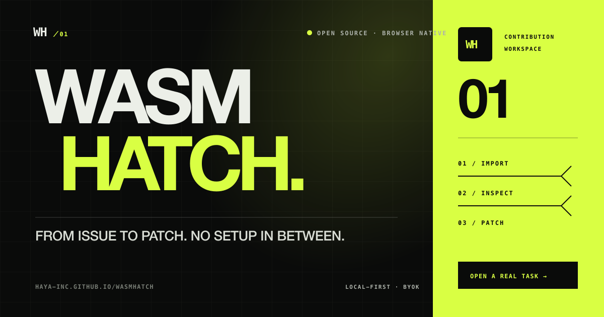
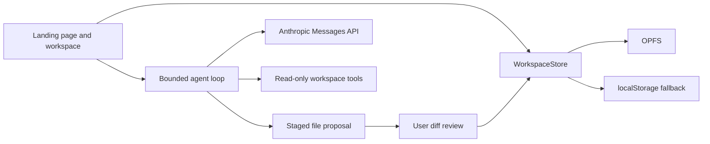

# WasmHatch

> From issue to patch. No setup in between.

[](https://haya-inc.github.io/wasmhatch/#examples)

WasmHatch is an open-source, browser-native coding workspace for small, focused
contributions. Import a public GitHub repository or zip archive, let an AI agent
inspect selected files through bounded tools, review every proposed write as a
diff, and export the result without installing a local toolchain.

The project is an early alpha. The browser workspace and review loop work; full
command execution and direct pull-request creation do not yet.

## Why WasmHatch

First-time contributors often lose more time configuring a repository than
making the change. WasmHatch is aimed at projects that want to put an **Open in
WasmHatch** link next to a small issue and give contributors a useful workspace
immediately.

- No account is required.
- Project files use browser-managed storage (OPFS where supported).
- Public GitHub repositories and zip archives can be imported.
- Text files can be edited and exported as a standard unified patch or zip.
- Claude can list and read files through explicit tools.
- Agent writes are staged until the user approves a visible diff.
- A no-key local demo exercises the complete review flow.

## Try it locally

Requirements: Node.js 20 or newer and a current desktop browser.

```bash
npm install
npm run dev
```

Open the URL printed by Vite. Use **Hatch a sample** to enter the workspace,
then run **Local demo**. An Anthropic API key is optional and is kept only in
the current tab's memory.

```bash
npm test
npm run build
```

## Add an Open in WasmHatch link

The project page includes a URL and badge builder. It accepts `repo`, optional
`ref`, `task`, and optional `issue` query parameters, prefills the repository
revision and task, and leaves the visitor in control of starting the import.

```markdown
[](https://haya-inc.github.io/wasmhatch/?view=workspace&repo=OWNER/REPOSITORY&ref=BRANCH_OR_TAG&task=DESCRIBE%20A%20SMALL%20CHANGE&issue=https%3A%2F%2Fgithub.com%2FOWNER%2FREPOSITORY%2Fissues%2F123)
```

Encode the task as a URL query value and keep it focused enough to review as one
patch. When supplied, `issue` must be a canonical public GitHub Issue URL; it is
kept visible through patch export so contributors can return to the acceptance
criteria and submission thread. Automatic repository fetching is intentionally
not triggered by merely opening a link.

## Try a real task

The [Examples section](https://haya-inc.github.io/wasmhatch/#examples) contains
three small tasks against exact public commits:

- fix WasmHatch's [`.git/` GitHub URL normalization edge case](https://github.com/haya-inc/wasmhatch/issues/1), published as a `good first issue`;
- add network-free CLI smoke tests to `create-knowledge-kit`;
- establish the first test baseline for `create-wiki-kit`.

Each task is sized for one reviewable patch and opens with the repository,
revision, and task already filled in. These are real repositories rather than
tutorial fixtures.

## Export a patch

WasmHatch records a separate baseline whenever a sample, GitHub repository, or
zip archive is imported. Manual and agent-approved edits change only the working
tree. Use **Patch** in the workspace header to download the difference as
`wasmhatch.patch`:

```bash
git apply --check wasmhatch.patch
git apply wasmhatch.patch
```

The baseline is stored separately in OPFS and survives reload. The patch can
represent modified, added, and removed text files; the current UI does not yet
expose file deletion.

## Current capability matrix

| Capability | Status |
| --- | --- |
| OPFS workspace with localStorage fallback | Available |
| Public GitHub repository import | Available, text files up to documented limits |
| Zip import and export | Available |
| Manual editing and persistence | Available |
| Persistent import baseline and unified patch export | Available |
| Review-before-write agent proposals | Available |
| Anthropic Messages API tool loop | Alpha, BYOK |
| Share URL and badge builder | Available |
| Shareable `repo`, `ref`, `task`, and GitHub `issue` context | Available |
| Revision-pinned real task examples | Available |
| Share-ready Open Graph and large-card preview | Available |
| Local-directory write-back | Planned |
| Browser command runtime | Under evaluation; not required for the core flow |
| Git commit and pull-request creation | Planned |

## Trust model

Local-first does not mean secret or offline.

- Workspace files remain in browser-managed storage until an explicit import,
  export, or model tool result sends data elsewhere.
- The model receives only tool-requested file content, but that content does
  leave the device and is governed by the selected provider's terms.
- The Anthropic key is not persisted. A browser application cannot turn an API
  key into a perfectly isolated secret, so use a dedicated key with a spending
  limit and revoke it after testing.
- Imported archives are limited to 20 MB, 500 text files, and 2 MB per file.
- Paths are normalized and traversal outside the workspace is rejected.
- Command execution is deliberately absent until runtime licensing, network
  egress, and secret-file handling are proven.

Read the full [project plan](docs/plan.md) and [security policy](SECURITY.md).

## Architecture



The browser command runtime remains an adapter rather than a core dependency.
This lets the editing and review flow work without a proprietary or
vendor-hosted runtime.

## Contributing

Small, reviewable contributions are welcome. Start with
[CONTRIBUTING.md](CONTRIBUTING.md), run the test and build commands, and explain
the user-visible outcome in your pull request.

High-value areas include:

- browser filesystem contract tests;
- accessible keyboard workflows;
- safer archive and repository import;
- deterministic agent fixtures;
- an embeddable **Open in WasmHatch** link;
- runtime research with explicit license and security boundaries.

## License

Apache-2.0. WasmHatch is not affiliated with Anthropic, Claude, StackBlitz, or
GitHub.
