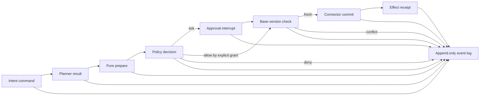

# OSS Design Study for WasmHatch

> Evidence to inform the architecture, not an architecture to copy.

- Status: reviewed research baseline; dependency choices remain spike-gated
- Updated: 2026-07-12
- Scope: connectors, agent interruption, effect approval, stale-write
  prevention, audit, policy, and spreadsheet mutation

## 1. Research position

WasmHatch should not become a smaller clone of an existing workflow server.
The projects in this study solve different problems under different trust,
deployment, and licensing constraints. We use them to identify mechanisms that
have survived real usage, failure modes that should not be rediscovered, and
interfaces that external contributors can understand.

The decision rule is:

1. Start from the WasmHatch product invariant.
2. Find more than one independent implementation of the underlying pattern.
3. Understand the source-level mechanism and its operational cost.
4. Re-design the smallest protocol that satisfies the invariant.
5. Validate it with a focused spike and adversarial tests.
6. Adopt a dependency only if integration is better than implementing the
   small protocol ourselves.

Popularity is evidence of exposure to real workloads, not proof that a design
fits WasmHatch.

## 2. WasmHatch constraints used for evaluation

Every candidate is evaluated against these non-negotiable constraints:

- foreground browser operation must remain useful without a WasmHatch server;
- credentials belong to a connector host and never enter model or sandbox
  input;
- model output may request an operation but cannot grant authority;
- local scripts receive bounded values or files and no ambient network, DOM,
  storage, or connector capability;
- every external mutation is prepared as an inspectable effect before commit;
- approval must bind to the exact effect, target, and source version reviewed;
- stale or ambiguous effects fail closed rather than being silently rebased;
- state and audit artifacts remain exportable and understandable without the
  original model provider;
- background execution, if added, must be an explicit adapter rather than a
  hidden requirement of the browser product;
- the project remains Apache-2.0 and should have a low-friction contributor
  surface.

## 3. Selected references

Repository activity was checked on 2026-07-12. Star counts are rounded and are
only adoption signals.

| Project | License boundary | Adoption signal | Primary question for WasmHatch | Reuse stance |
| --- | --- | ---: | --- | --- |
| [Activepieces](https://github.com/activepieces/activepieces) | Community edition MIT; enterprise code commercial | 23k stars | How should community connectors describe auth, actions, inputs, outputs, and compatibility? | Adapt the manifest and test patterns, not the runtime |
| [Windmill](https://github.com/windmill-labs/windmill) | Core server/frontend AGPLv3; clients and OpenFlow Apache-2.0; proprietary features also present | 17k stars | How do scripts, typed resources, jobs, suspend/resume, permissions, and approvals compose? | Study behavior and Apache specs; do not copy AGPL code |
| [LangGraph.js](https://github.com/langchain-ai/langgraphjs) | MIT | 3k stars | What state is required to pause an agent at a tool boundary and resume safely? | Adapt checkpoint and interrupt semantics, avoid framework coupling initially |
| [Temporal](https://github.com/temporalio/temporal) | MIT server and SDKs | 21k stars | How are orchestration state and side effects separated for replay and failure recovery? | Borrow event-history and idempotency principles, not the cluster |
| [Grist Core](https://github.com/gristlabs/grist-core) | Apache-2.0 core; additional editions/features have separate boundaries | 11k stars | What is a robust mutation and history model for spreadsheet-like data? | Adapt typed action bundles and action summaries |
| [Univer](https://github.com/dream-num/univer) | Apache-2.0 core/plugins; collaboration, edit history, import/export, and other features may be Pro | 14k stars | How should a browser spreadsheet separate commands, mutations, operations, and undo? | Adapt the command taxonomy; evaluate dependency only for richer local editing |
| [Kubernetes](https://github.com/kubernetes/kubernetes) | Apache-2.0 | 124k stars | How should a client prevent lost updates against changing remote state? | Adopt the conditional-update semantics directly |
| [Open Policy Agent](https://github.com/open-policy-agent/opa) | Apache-2.0 | 12k stars | How should authorization decisions be pure, versioned, traceable, and redactable? | Use a compatible decision envelope; defer Rego/OPA dependency |

### Adjacent project deliberately not used as an OSS code baseline

[n8n](https://github.com/n8n-io/n8n) is an important product benchmark, but its
main code is under the Sustainable Use License rather than an OSI-approved open
source license. We may compare product behavior, but should not copy its code or
present it as an OSS dependency.

## 4. Activepieces: contributor-friendly connector definitions

### What was inspected

- [Piece definition source](https://github.com/activepieces/activepieces/blob/b60490a4be247a15b624dfc3db77aaaf32a5d874/packages/pieces/framework/src/lib/piece.ts)
- [Action definition source](https://github.com/activepieces/activepieces/blob/b60490a4be247a15b624dfc3db77aaaf32a5d874/packages/pieces/framework/src/lib/action/action.ts)
- [Authentication reference](https://www.activepieces.com/docs/build-pieces/piece-reference/authentication)
- [Piece versioning](https://www.activepieces.com/docs/build-pieces/piece-reference/piece-versioning)
- [Piece testing](https://www.activepieces.com/docs/build-pieces/misc/testing-pieces)
- [Legacy approval action](https://github.com/activepieces/activepieces/blob/b60490a4be247a15b624dfc3db77aaaf32a5d874/packages/pieces/core/approval/src/lib/actions/wait-for-approval.ts)

### Mechanisms that work

`Piece` is metadata plus named actions and triggers. Authentication is declared
separately from action properties, actions receive typed context, and pieces
carry minimum and maximum compatible releases. Piece packages follow semantic
versioning, with adding a required property or changing existing behavior
treated as breaking. The test helper creates a mock action context, making an
individual connector testable without the full product.

The approval source is more instructive than its UI. A first invocation creates
a waitpoint and suspends; a resumed invocation consumes a resume payload. The
source now warns authors to use the newer Manual Task feature. This evolution
suggests that approval is a runtime primitive, not an ordinary third-party
connector action.

### What WasmHatch should adopt

- A connector package is a versioned manifest plus named operations.
- Auth schema, user input schema, output schema, effect class, and compatibility
  range are separate fields.
- A connector operation has a mockable context and deterministic fixtures.
- Connector additions are independently buildable and testable.
- Breaking changes are defined in terms of saved workflow compatibility, not
  only TypeScript compilation.
- Human approval belongs to the WasmHatch effect runtime, not to a Google,
  Slack, or email connector.

### What not to copy

- An arbitrary connector action should not receive a raw credential plus an
  unrestricted HTTP client. In a community ecosystem that combination allows a
  malicious or mistaken connector to exfiltrate credentials.
- Server-side token caching and refresh are inappropriate for the foreground
  alpha.
- The full flow builder and hundreds of integrations would erase the product
  wedge and overwhelm review capacity.
- Enterprise-licensed directories are outside the reusable baseline.

### WasmHatch-specific improvement

The connector manifest should declare allowed origins and operation paths. A
credential broker, not connector code, should attach credentials after target
validation. Connector code receives a narrow `AuthorizedRequest` capability or
domain client rather than token text.

## 5. Windmill: typed resources, jobs, and suspend/resume

### What was inspected

- [OpenFlow specification](https://www.windmill.dev/docs/openflow)
- [Flow architecture](https://www.windmill.dev/docs/flows/architecture)
- [Scripts and typed entrypoints](https://www.windmill.dev/docs/script_editor)
- [Suspend and approval](https://www.windmill.dev/docs/flows/flow_approval)
- [Workflows as code](https://www.windmill.dev/docs/core_concepts/workflows_as_code)
- [Variables and secrets](https://www.windmill.dev/docs/core_concepts/variables_and_secrets)
- [Roles and permissions](https://www.windmill.dev/docs/core_concepts/roles_and_permissions)
- [Jobs](https://www.windmill.dev/docs/core_concepts/jobs)
- [Retry behavior](https://www.windmill.dev/docs/flows/retries)
- [`resume_job` schema](https://github.com/windmill-labs/windmill/blob/1ed7fc066be3b85a3b49c91cf23d8dd2bd8ca944/backend/migrations/20220902211654_job-resume.up.sql)

### Mechanisms that work

OpenFlow is JSON-serializable and separates flow definition from job execution.
Each step becomes a job, which gives retries, timeouts, logs, and parallelism a
stable unit. `waitForApproval()` is a blocking checkpoint: completed step
results are replayed, the worker is released while waiting, and the approval
returns value, approver, and approved status. Approval supports timeout,
required counts, rejection paths, self-approval policy, and approver groups.

Windmill distinguishes `created_by` from `permissioned_as`. Resource and secret
references are resolved at execution using the job's permissions. Secret reads
are audited and known plaintext values are masked before logs are persisted.

### What WasmHatch should adopt

- Workflow and effect state must be JSON-serializable.
- A step has a stable ID and independently recorded attempt/result.
- Waiting for approval consumes no script worker and has explicit timeout and
  rejection behavior.
- The actor who requested an effect, the identity whose authority is used, and
  the actor who approved it are distinct audit fields.
- Credential references are resolved as late as possible under current policy.
- Secrets are redacted before persistence, not only hidden in the UI.
- Error, timeout, retry, and rejection are data, not ad-hoc strings.

### What not to copy

- Multi-language server workers, queues, ACL storage, schedules, and app
  builders are not needed for a foreground browser slice.
- Retrying a mutation by default is unsafe without an idempotency key and a
  provider-specific result check.
- Several advanced approval and concurrency controls are enterprise features;
  WasmHatch's safety baseline must not depend on a proprietary tier.
- Windmill core is AGPLv3. We can implement independently from behavior and use
  Apache-licensed OpenFlow ideas, but must not paste AGPL implementation code
  into the Apache-2.0 WasmHatch repository.

### WasmHatch-specific improvement

In foreground mode, persist a small step journal in the local workspace and
release the Web Worker at every boundary. If a future server adapter is present,
the same journal contract can be durably hosted without changing the connector
or approval schemas.

## 6. LangGraph: dynamic interrupts backed by checkpoints

### What was inspected

- [Interrupt documentation](https://docs.langchain.com/oss/javascript/langgraph/interrupts)
- [Persistence documentation](https://docs.langchain.com/oss/javascript/langgraph/persistence)
- [Interrupt implementation](https://github.com/langchain-ai/langgraphjs/blob/ada0b67696d2dadb59c2f274f45c585aa4fef0e4/libs/langgraph-core/src/interrupt.ts)
- [Checkpoint base implementation](https://github.com/langchain-ai/langgraphjs/blob/ada0b67696d2dadb59c2f274f45c585aa4fef0e4/libs/checkpoint/src/base.ts)

### Mechanisms that work

An interrupt emits a JSON-serializable value, throws a special runtime signal,
and requires a checkpointer. Resume input is supplied explicitly with a
`Command`. Checkpoints have an ID, timestamp, channel values, per-channel
versions, parent configuration, and pending writes. This makes inspection,
forking, replay, and recovery possible.

The most important rule is easy to miss: resuming restarts the node from the
beginning. Code before the interrupt may execute again. Interrupt order must be
deterministic, and side effects before an interrupt are unsafe unless they are
idempotent or checkpointed separately.

### What WasmHatch should adopt

- Approval input is a typed resume command bound to one interrupt ID.
- Interrupt payloads are values only; functions and ambient runtime handles are
  forbidden.
- Checkpoints have explicit versions and parent links.
- Pending writes are recorded separately from completed state.
- A resumed step may replay, so preparation must be pure and commit must be a
  separate step.
- Editing a proposal produces a new proposal and interrupt rather than mutating
  the approved object in place.

### What not to copy

- WasmHatch does not yet need a graph DSL, Pregel execution model, channel
  algebra, or LangChain model abstraction.
- A framework checkpointer does not by itself solve external API idempotency or
  stale source data.
- Model conversation state should not become the source of truth for effects.

### WasmHatch-specific improvement

Implement the approval state machine as a small provider-neutral library first.
Keep its checkpoint envelope compatible with persistent storage, but avoid a
LangGraph dependency until real workflows require branching, time travel, and
multi-agent graphs.

## 7. Temporal: deterministic orchestration and side-effect activities

### What was inspected

- [Temporal server repository and license](https://github.com/temporalio/temporal)
- [Architecture overview](https://github.com/temporalio/temporal/blob/main/docs/architecture/README.md)
- [Temporal documentation](https://docs.temporal.io/)

### Mechanisms that work

Temporal stores an append-only event history and reconstructs workflow state by
replaying it. Workflow code is deterministic and side-effect free; activities
perform external work and must be idempotent or explicitly non-retryable. A
workflow task advances orchestration by emitting commands, while an activity
task reports an external result.

This separation prevents a common agent bug: replaying reasoning accidentally
repeats a payment, message, or write. It also makes retry policy a property of
the effect activity rather than a generic agent-loop behavior.

### What WasmHatch should adopt

- An append-only event history is authoritative; current UI state is derived.
- Planning, preparation, policy decision, approval, commit, and receipt are
  separate events.
- External commit attempts carry a stable idempotency key when the provider
  supports one.
- Retry policy is declared per operation and defaults to no automatic retry for
  non-idempotent writes.
- Model output and script output are ordinary recorded inputs to orchestration,
  not privileged control flow.

### What not to copy

- A Temporal server, database, matching service, and worker fleet are excessive
  for a foreground-only browser run.
- Full event replay across changing model calls is neither deterministic nor
  desirable. Record model results; do not call the model again during replay.
- Temporal-level durability should enter only through the optional background
  adapter if pilots require unattended workflows.

### WasmHatch-specific improvement

Use a compact local event log now, with event shapes that a future durable
adapter can ingest. This preserves the architectural seam without introducing
infrastructure before demand.

## 8. Grist: typed spreadsheet actions and history

### What was inspected

- [Grist Core repository and license](https://github.com/gristlabs/grist-core)
- [Document action types](https://github.com/gristlabs/grist-core/blob/d1c11451450b507b0fe0dd72e6e4c38a1aaca173/app/common/DocActions.ts)
- [Action history](https://github.com/gristlabs/grist-core/blob/d1c11451450b507b0fe0dd72e6e4c38a1aaca173/app/server/lib/ActionHistory.ts)
- [Patch application](https://github.com/gristlabs/grist-core/blob/d1c11451450b507b0fe0dd72e6e4c38a1aaca173/app/server/lib/Patch.ts)
- [Sandboxed user actions](https://github.com/gristlabs/grist-core/blob/d1c11451450b507b0fe0dd72e6e4c38a1aaca173/sandbox/grist/useractions.py)
- [Technical documentation](https://support.getgrist.com/technical-docs/)

### Mechanisms that work

Grist represents edits as small typed actions such as `UpdateRecord`,
`BulkUpdateRecord`, `AddRecord`, and `RemoveRecord`. Action groups carry an
action number, hash, user, time, link to related actions, summary, and undo
information. Its history distinguishes local-unsent, local-sent, and shared
actions and compares an action hash when accepting a shared action.

Patch code applies cell and record changes through the same user-action path as
interactive edits. It deliberately rejects unsupported structural changes and
skips formula or hidden columns. This is preferable to pretending every diff is
safe to apply.

### What WasmHatch should adopt

- Spreadsheet effects use typed cell/record mutations, not whole-sheet blobs.
- Each effect has a machine payload and a human summary generated from the same
  mutations.
- A mutation batch has a sequence number/hash, actor, time, and links to its
  inverse or predecessor.
- Unsupported structural or formula changes fail explicitly.
- Local prepared, sent, and confirmed states are distinct.
- Undo metadata is generated at commit time from the actual accepted mutation.

### What not to copy

- WasmHatch should not build a relational spreadsheet engine, formula engine,
  collaboration hub, or SQLite document format before pilots require them.
- Whole Grist documents are not the portable interchange contract for external
  connectors.
- Action hashes do not replace provider-native concurrency tokens.

### WasmHatch-specific improvement

Define a small `TabularMutation` union that can represent cell updates, appended
rows, deleted rows, and structural changes separately. The first release allows
only cell updates and returns an explicit unsupported-effect result for the
others.

## 9. Univer: command, operation, and mutation separation

### What was inspected

- [Univer repository and OSS/Pro boundary](https://github.com/dream-num/univer)
- [Command service source](https://github.com/dream-num/univer/blob/ccf2a8cae8118a31804fe21171736b9fbd800ba4/packages/core/src/services/command/command.service.ts)
- [Sheets quickstart and snapshot model](https://docs.univer.ai/guides/sheets/getting-started/quickstart)

### Mechanisms that work

Univer separates:

- `COMMAND`: business orchestration that may produce mutations and inverse
  mutations;
- `OPERATION`: local UI state that is not stored in the document snapshot;
- `MUTATION`: serializable document state change and the smallest collaboration
  conflict-resolution unit.

The command service has unique IDs, serializable parameters, preconditions,
before/after listeners, execution options, and separate collaboration hooks.
This prevents cursor movement, dialog state, and other ephemeral UI operations
from polluting durable document history.

### What WasmHatch should adopt

- Distinguish user intent commands from durable effects and ephemeral UI
  operations.
- Durable mutation parameters are JSON-serializable.
- Every registered operation has a globally unique namespaced ID.
- Policy and audit hooks execute around commands without being embedded in each
  connector.
- Large mutation sets can be chunked for transport while remaining one logical
  proposal.

### What not to copy

- The full renderer, formula engine, document model, and plugin graph are too
  large for the current operator.
- Real-time collaboration, edit history, import/export, and several advanced
  features are Pro; do not assume the repository provides an Apache-licensed
  implementation of the entire product.
- Undo/redo in a local document does not solve an external connector conflict.

### WasmHatch-specific improvement

Keep the tabular model headless. Evaluate Univer later as an optional editor
adapter only if pilots require rich local spreadsheet editing. The effect model
must remain usable without Univer.

## 10. Kubernetes: lost-update prevention

### What was inspected

- [Kubernetes API concepts](https://kubernetes.io/docs/reference/using-api/api-concepts/)

### Mechanisms that work

Kubernetes returns an opaque `resourceVersion` with an object. A client includes
that version in an update. If the object changed, the API server rejects the
stale update with `409 Conflict`; the client must read again and decide whether
to construct a new update. Resource versions are passed back unmodified and
belong to a specific resource type.

Kubernetes also distinguishes replace from patch and supports strict field
validation. It does not silently interpret an unknown field as user intent.

### What WasmHatch should adopt

- Every prepared effect records a `baseVersion` with a declared provenance.
- Provider-native ETag, revision, sequence, or version tokens are opaque.
- Commit sends the precondition atomically when the provider supports it.
- A version mismatch returns a typed `conflict`, never an automatic write.
- Conflict resolution creates a new proposal and requires new approval.
- Unknown mutation fields are rejected before model or connector execution.

### Provider capability levels

WasmHatch should expose the truth instead of calling every hash a transaction:

| Level | Meaning | Commit behavior |
| --- | --- | --- |
| `atomic` | Provider accepts a version/ETag precondition in the same write | Send it; map mismatch to conflict |
| `recheck` | Provider can be read immediately before write but has no conditional mutation | Re-read and compare; warn that a race remains |
| `none` | No reliable source version or verification read | Block by default or require elevated approval |

The documented Google Sheets
[`spreadsheets.values.update`](https://developers.google.com/workspace/sheets/api/reference/rest/v4/spreadsheets.values/update)
request exposes spreadsheet ID, range, value input mode, and response rendering
options, but no value-range revision precondition. A read/hash/recheck improves
safety but is not equivalent to Kubernetes-style atomic conflict detection. The
UI and audit record must label it `recheck`, not `atomic`.

## 11. Open Policy Agent: pure, versioned policy decisions

### What was inspected

- [OPA repository and license](https://github.com/open-policy-agent/opa)
- [Integration options](https://www.openpolicyagent.org/docs/integration)
- [Decision logs](https://www.openpolicyagent.org/docs/management-decision-logs)
- [WebAssembly compilation](https://www.openpolicyagent.org/docs/wasm)
- [Policy bundles and revisions](https://www.openpolicyagent.org/docs/management-bundles)

### Mechanisms that work

OPA evaluates JSON input against versioned policy/data and returns a JSON
decision. Decision logs include a decision ID, policy bundle revision, input,
result, timestamp, and trace identifiers. A separate masking policy can remove
or replace sensitive JSON paths before logs leave the process. Policies can be
compiled to Wasm for embedding.

### What WasmHatch should adopt

- Policy evaluation is a pure function over a documented JSON input.
- Every policy answer has a decision ID and policy revision.
- The decision returns `allow`, `ask`, or `deny` plus reasons and obligations.
- Audit masking happens structurally by JSON path before persistence/export.
- Failure to load or evaluate mandatory policy fails closed.
- A policy engine is an adapter behind the same decision contract.

### What not to copy

- Rego, bundle distribution, a management control plane, and remote decision-log
  upload are unnecessary for the foreground alpha.
- Policy must not inspect raw credential values.
- A boolean `allow` is insufficient for effect review; obligations such as
  `require_approval`, `max_rows`, or `redact_fields` are part of the result.

### WasmHatch-specific improvement

Start with a small TypeScript evaluator and a stable OPA-compatible envelope.
Add an OPA-Wasm adapter only when teams need declarative custom policy. This
keeps the default bundle small without closing the extension point.

## 12. Synthesis: the architecture WasmHatch should build

No examined project provides the exact combination we need. The best design is
a synthesis:



### 12.1 Connector contract

```ts
interface ConnectorManifest {
  id: string;
  version: string;
  compatibleCore: string;
  auth: AuthSchema;
  allowedOrigins: string[];
  operations: OperationManifest[];
}

interface OperationManifest {
  id: string;
  effect: "read" | "compute" | "prepare" | "commit";
  inputSchema: JsonSchema;
  outputSchema: JsonSchema;
  retry: "never" | "idempotent";
  precondition: "atomic" | "recheck" | "none";
}
```

The manifest is inspectable and contribution-friendly like Activepieces, but
the credential broker enforces target origins and attaches credentials after
validation.

### 12.2 Effect proposal

```ts
interface EffectProposal {
  proposalId: string;       // content-addressed
  operation: string;
  connector: { id: string; version: string };
  target: JsonValue;
  baseVersion: {
    kind: "etag" | "revision" | "sequence" | "snapshot-hash";
    value: string;
    strength: "atomic" | "recheck" | "none";
  };
  mutations: TabularMutation[];
  summary: EffectSummary;
  policyDecisionId: string;
  expiresAt: string | null;
}
```

The proposal ID covers connector/version, operation, normalized target,
base-version record, mutations, and policy decision. It does not cover mutable
display state. Approval binds the proposal ID and cannot be reused after an
edit, policy change, expiry, or source conflict.

### 12.3 Approval command

```ts
type ApprovalDecision = {
  interruptId: string;
  proposalId: string;
  decision: "approve" | "reject";
  actor: string;
  decidedAt: string;
};
```

Editing is not an approval decision. An edit returns to `prepare` and creates a
new proposal. This combines Windmill's approver identity with LangGraph's exact
interrupt/resume binding.

### 12.4 State machine

```text
planned
  -> prepared
  -> allowed | awaiting_approval | denied
  -> approved | rejected | expired
  -> validating_source
  -> committing | conflict
  -> committed | failed | uncertain
```

`uncertain` is essential. A network timeout after sending a write does not prove
that nothing happened. The connector must reconcile using an idempotency key,
provider receipt, or a bounded verification read before another attempt.

### 12.5 Event record

```ts
interface RunEvent {
  eventId: string;
  runId: string;
  sequence: number;
  type: string;
  occurredAt: string;
  actor: ActorRef;
  parentEventId?: string;
  payload: JsonValue;
  payloadHash: string;
  redactions: string[];
}
```

The local UI is a projection of events. Model calls are not replayed; their
bounded request manifest and response are recorded. Secret values are excluded
or structurally redacted before an event is stored.

## 13. Design rules derived from the comparison

1. **Prepare is pure; commit is effectful.** No network mutation may occur while
   constructing a proposal.
2. **Approval names an immutable proposal.** It is never a general permission to
   perform “something similar.”
3. **Conflict is a product state.** It is not an exception to hide or retry
   away.
4. **Provider guarantees are explicit.** A recheck hash is not marketed as an
   atomic precondition.
5. **Retry only known-idempotent operations.** Unknown outcomes enter
   `uncertain` and require reconciliation.
6. **Credential text is not connector input.** The broker attaches authority to
   a validated target.
7. **Policy is pure and traceable.** A decision has an ID, version, reason, and
   obligations.
8. **UI operations are not durable mutations.** Selection, panels, and editing
   state do not pollute effect history.
9. **Unsupported effects fail explicitly.** Formula, structural, or overly large
   changes do not fall through to a generic write.
10. **Server durability is an adapter.** The browser protocol remains valid
    without Temporal, Windmill, or another workflow service.
11. **Dependencies must earn their cost.** We prefer a small protocol over a
    framework when only one primitive is needed.
12. **Contributor APIs are versioned products.** Manifests, fixtures, and
    compatibility tests are part of the public OSS contract.

## 14. Research-driven implementation spikes

These are experiments, not commitments. Each spike must be small enough to
discard.

### Spike A: connector manifest and credential broker

Build one local connector and one Google Sheets connector against the proposed
manifest.

Status on 2026-07-12: implemented in
[`connector.ts`](../src/lib/connector.ts) and integrated into
[`spreadsheet.ts`](../src/lib/spreadsheet.ts). Both local and Google Sheets
publish strict, deeply frozen manifests. Google Sheets now receives only a
manifest-bound transport; the host broker resolves bearer credentials after
validating the operation, origin, method, path, query, headers, body size, and
response size. Each transport is additionally bound to explicit operations and
path resources, so a selected spreadsheet or range cannot be replaced by
connector code. Redirects and connector-supplied authorization headers are blocked.

The provider callback is evaluated for every request, so a future OAuth host can
refresh credentials without returning token text to connector code. A public
fixture transport runs the same request validation without credentials, network,
or application UI. Tests prove unknown-field rejection, incompatible-core
rejection, undeclared-origin rejection, secret absence from connector-visible
objects, refresh-provider behavior, and bounded fixtures.

This is a capability boundary for reviewed, bundled connector code, not a
sandbox for arbitrary third-party JavaScript. Loading untrusted connector
packages dynamically remains out of scope until their code executes in an
isolated realm with the same broker protocol.

Prove:

- schema validation rejects unknown fields;
- connector code cannot read credential text;
- the broker rejects undeclared origins;
- mocked operation fixtures run without the application UI;
- manifest compatibility checks reject unsupported core versions.

Result: the broker supports refresh through a host-only token callback without
exposing a general authenticated `fetch`; the kill condition did not trigger.

### Spike B: prepare / approve / commit with conflicts

Use an in-memory connector that supports true atomic revisions and a Google
Sheets adapter labeled `recheck`.

Status on 2026-07-12: the `atomic`, `recheck`, and `none` branches are
implemented in
[`spreadsheet-effect.ts`](../src/lib/spreadsheet-effect.ts), with unit and browser
tests covering immutable content identity, exact approval binding, unsupported
fields, conflict, duplicate execution, rejection, and `uncertain` outcomes.
Google Sheets re-reads the approved range before PUT. A changed snapshot consumes
the proposal as a conflict; a transport failure, unreadable success response,
HTTP timeout, or 5xx consumes it as `uncertain` and requires reconciliation.

The atomic branch is not simulated through a hash. It requires an ETag, revision,
or sequence plus a connector `writeConditional` implementation, passes that
opaque version into the same write, and maps `SpreadsheetConflictError` to a
terminal typed conflict. An in-memory connector proves both atomic success and a
stale-revision conflict without a preceding recheck read. No current production
connector advertises atomic support; Google Sheets continues to disclose
`recheck` and its remaining race.

Prove:

- a proposal is content-addressed and deeply immutable;
- approval fails after any target, mutation, base, or policy change;
- an atomic stale version returns typed conflict;
- a recheck detects a changed range before write and discloses the remaining
  race;
- network timeout after commit enters `uncertain` and does not auto-retry.

Kill or redesign if the UI cannot explain `atomic`, `recheck`, and `none`
without technical jargon.

### Spike C: checkpointed interrupt state machine

Implement the state machine without LangGraph, using JSON checkpoints and a
memory store plus OPFS test adapter.

Prove:

- reload resumes the exact interrupt;
- duplicate resume commands are rejected or idempotent;
- code before an interrupt can replay without effects;
- pending and committed writes are distinguishable;
- corrupted or unsupported checkpoint versions fail closed with exportable
  recovery data.

Adopt LangGraph only if branching and time-travel requirements make the small
implementation less reliable or harder to maintain.

### Spike D: policy envelope and audit masking

Implement a TypeScript evaluator for `allow`, `ask`, and `deny` with obligations.

Prove:

- policy revision and decision ID appear on every proposal;
- deny and missing-policy cases fail closed;
- JSON-pointer masking removes secrets before persistence;
- an OPA-Wasm fixture can later implement the same interface without changing
  proposal or UI code.

### Spike E: tabular mutation adapter

Represent cell updates as typed mutations and generate the preview from them,
not from two unrelated table snapshots.

Status on 2026-07-12: implemented in
[`spreadsheet-mutation.ts`](../src/lib/spreadsheet-mutation.ts) and proposal
schema 2. The effect stores a base snapshot and an ordered, deeply frozen cell
mutation bundle, but no second completed table. Strict validation rejects
unknown fields, duplicate or unordered coordinates, out-of-shape cells, stale
before-values, forged formula kinds, and more than 100,000 mutations. Preview,
summary, and connector values all derive from that bundle.

The current `spreadsheet.cells.update` operation requires an unchanged table
shape because Google Sheets `values.update` cannot faithfully express every
row/column insertion, deletion, or trailing-cell clear. Those changes return a
typed `structural_change` error instead of a misleading preview. Values beginning
with `=` under `USER_ENTERED` become `cell.set-formula` mutations and are blocked
without a future dedicated high-risk capability. A successful commit receipt
contains an inverse bundle as metadata; it does not silently execute undo.

Prove:

- mutation payload, preview, summary, and commit request cannot diverge;
- formula and structural changes are classified separately;
- accepted mutations generate a receipt and inverse metadata;
- a future Grist or Univer adapter can translate the same mutations.

Result: all four properties are covered by unit and browser-flow tests. The kill
condition is now any connector that cannot deterministically translate the same
accepted bundle into its provider request; such a connector must define a new
typed operation rather than reinterpret `spreadsheet.cells.update`.

## 15. Recommended sequence after research review

1. Spike B first because incorrect effect identity or stale handling can cause
   data loss.
2. Spike A next because the connector contract is the primary OSS contribution
   surface.
3. Spike E so spreadsheet previews and writes share one mutation source.
4. Spike C before adding multi-step autonomous tool use.
5. Spike D before persisted grants or team policy.
6. Add OAuth only after the credential broker contract from Spike A is stable.
7. Evaluate a durable server adapter only after a pilot requires unattended
   execution.

No new runtime dependency is selected by this study. The first implementation
should test the protocols with small local code. Dependency choices follow the
spikes, not the other way around.

## 16. Questions that remain open

- Can Google Drive revision IDs provide a useful atomic boundary for Sheets
  value updates, or only a coarse file-change signal?
- Which connector operations expose native ETags, revisions, conditional
  requests, or idempotency keys?
- Should a proposal be valid only for one browser tab, one workspace, or a
  portable signed run?
- What minimum event history is sufficient for pilot debugging without storing
  sensitive model input?
- Are cell-level mutations enough for the first five pilots, or do append,
  delete, and new-sheet operations need P0 support?
- How should approval identity work before WasmHatch has accounts?
- Which policy obligations are understandable to a non-technical operator?

Answers must come from spikes and pilot evidence. They should not be inferred
from whichever reference project is easiest to imitate.

## 17. Research maintenance

- Pin source observations to a commit permalink where possible.
- Re-check license boundaries before adding or copying any dependency or code.
- Record which spike or test validates every adopted pattern.
- Move rejected patterns to an explicit decision log rather than silently
  deleting them.
- Refresh this study when a connector, persistence, or policy dependency is
  selected.
