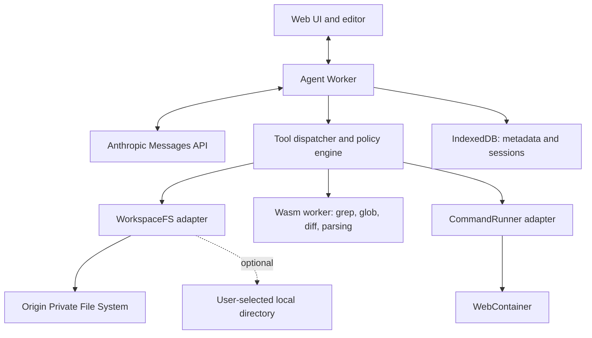

# WasmHatch Project Plan

> A browser-native, local-first AI coding agent powered by WebAssembly.

- Status: Active alpha
- Updated: 2026-07-12
- Repository: <https://github.com/haya-inc/wasmhatch>

## 1. Overview

WasmHatch is an open-source coding workspace that runs primarily in the browser.
Its initial wedge is the path from a small public GitHub issue to a reviewable,
exportable patch without requiring a native installation. It does not compete
for full IDE or Claude Code parity in the first release.

The initial model provider is Anthropic. Users bring their own API key (BYOK),
and their workspace is stored locally in browser-managed storage by default.
The architecture should not prevent adding other model providers later.

WasmHatch does not attempt to compile the Claude Agent SDK itself to
WebAssembly. Instead, it implements an agent loop using the Claude Messages API
and executes client tools inside the browser.

## 2. Product principles

1. **Local-first**: project files remain on the user's device unless a tool call
   requires selected content to be sent to the model API.
2. **BYOK**: users provide their own API key. WasmHatch does not operate a
   shared model gateway in the initial release.
3. **Explicit capabilities**: the model can only perform operations exposed as
   typed tools.
4. **Reviewable changes**: file writes, patches, deletes, and commands are
   visible to the user and can require approval.
5. **Browser-native**: installation-free usage is the default experience.
6. **Portable core**: filesystem, agent, and runtime integrations use adapters
   so they can evolve independently.
7. **Provider independence**: Anthropic is the first provider, not a permanent
   architectural dependency.
8. **No false affiliation**: the project must clearly state that it is not an
   official Anthropic or Claude product.

## 3. Goals

### 3.1 Initial goals

- Open and persist a multi-file workspace in the browser.
- Stream model responses using a user-provided Anthropic API key.
- Let the model inspect the workspace on demand rather than sending the entire
  repository with every request.
- Support file listing, reading, searching, patching, writing, moving, and
  deleting through client-executed tools.
- Provide diffs and user approval before risky changes.
- Import and export a project as an archive.
- Recover the workspace and conversation after a reload without persisting the
  API key.
- Open a public GitHub repository from a compact `owner/repository` reference.
- Exercise the complete review flow without requiring a model API key.

### 3.2 Non-goals for the first release

- Running the Claude Agent SDK or Claude Code native executable in Wasm.
- Reproducing Claude Code's private prompts or implementation details.
- Supporting arbitrary native binaries, Docker, or every programming language.
- Perfect shell or POSIX filesystem compatibility.
- Persisting API keys for automatic sign-in.
- Full browser parity from the first alpha.
- Silent execution of destructive operations.
- Requiring a vendor-hosted command runtime for the core edit-review-export
  workflow.

## 4. Target user flow

1. The user opens WasmHatch over HTTPS.
2. The user enters an Anthropic API key for the current session.
3. The user creates an OPFS workspace, imports an archive, or opens a local
   directory where supported.
4. WasmHatch indexes paths and lightweight metadata without uploading files.
5. The user describes a coding task.
6. Claude requests tools such as `read_file`, `grep`, or `apply_patch`.
7. WasmHatch executes allowed tools locally and returns bounded results.
8. Proposed writes and commands are displayed for approval according to the
   configured permission policy.
9. The agent runs tests or build commands, reads the output, and continues.
10. The user reviews the final diff and exports or writes changes back to the
    selected local directory.

## 5. High-level architecture



### 5.1 Web UI

- Workspace/project picker
- Code editor and file tree
- Chat and streamed activity view
- Tool approval prompts
- Diff viewer
- Command output terminal
- Storage usage and export controls
- API-key session form

### 5.2 Agent Worker

The model SDK and agent loop run in a dedicated Web Worker so streaming,
conversation processing, and tool coordination do not block the UI.

The API key exists only in this worker's memory. It must not be copied into
OPFS, IndexedDB, `localStorage`, command environments, preview frames, logs, or
telemetry.

The TypeScript Anthropic SDK can be used in a browser with
`dangerouslyAllowBrowser: true`. The option acknowledges that the caller is
responsible for protecting the key; it does not make the browser a secret
store.

### 5.3 Tool dispatcher and policy engine

The dispatcher validates model-provided input, applies permission policy,
executes the selected local capability, bounds the output, and converts it to a
tool result.

The policy engine must be independent of model prompts. Prompt instructions
cannot grant capabilities that the current policy denies.

### 5.4 Wasm worker

WebAssembly is used where it materially improves portability, isolation, or
performance. Initial candidates are:

- Recursive text search
- Glob matching and ignore processing
- Diff and patch operations
- Syntax-aware indexing
- Parsers and formatters compiled from Rust
- Selected WASI-compatible command-line utilities

The network SDK does not need to be compiled to Wasm. JavaScript host code can
bridge asynchronous browser APIs such as OPFS and `fetch` to the Wasm core.

## 6. Filesystem plan

### 6.1 Storage roles

| Data | Storage | Notes |
| --- | --- | --- |
| Project files | OPFS | Canonical workspace for the initial release |
| Workspace metadata | IndexedDB | Names, timestamps, indexes, permissions |
| Conversation state | IndexedDB | Must not contain the API key |
| UI preferences | `localStorage` | Theme and small non-sensitive values only |
| API key | Memory only | Cleared on reload/tab close |
| Local directory handle | IndexedDB | Optional; permission must be rechecked |

`localStorage` is not suitable for project files because it is synchronous,
string-only, and small. OPFS supports directories, binary files, asynchronous
access, and fast synchronous file access from dedicated workers.

### 6.2 Workspace layout

The OPFS implementation should keep internal data separate from the exported
project tree.

```text
/workspaces/<workspace-id>/tree/...
/snapshots/<workspace-id>/<snapshot-id>/...
```

Project metadata and indexes belong in IndexedDB so internal state does not
appear as user source files or get sent to tools accidentally.

### 6.3 WorkspaceFS interface

The agent and UI should depend on an adapter rather than browser APIs directly.

```ts
interface WorkspaceFS {
  stat(path: string): Promise<FileStat>;
  readDir(path: string): Promise<DirectoryEntry[]>;
  readFile(path: string, range?: ByteRange): Promise<Uint8Array>;
  writeFile(path: string, data: Uint8Array, options?: WriteOptions): Promise<void>;
  createDir(path: string): Promise<void>;
  move(from: string, to: string): Promise<void>;
  remove(path: string, options?: RemoveOptions): Promise<void>;
  glob(patterns: string[], options?: GlobOptions): Promise<string[]>;
  grep(query: GrepQuery): Promise<GrepMatch[]>;
  snapshot(label?: string): Promise<SnapshotRef>;
}
```

Potential adapters:

- `OpfsWorkspaceFS`: default persistent browser workspace
- `LocalDirectoryWorkspaceFS`: File System Access API
- `MemoryWorkspaceFS`: unit tests and ephemeral demos
- `WebContainerWorkspaceFS`: command-runtime session filesystem

### 6.4 Filesystem invariants

- Normalize all paths to workspace-relative POSIX-style paths.
- Reject absolute paths, NUL bytes, and traversal through `..`.
- Apply `.gitignore` plus WasmHatch-specific excludes.
- Exclude directories such as `node_modules` and build outputs by default.
- Bound file sizes, directory result counts, search matches, and tool output.
- Use content hashes as patch preconditions to detect concurrent edits.
- Create a snapshot or undo record before destructive operations.
- Return ranges or line windows for large files instead of entire contents.
- Treat binary files separately and never decode them as text implicitly.
- Handle `QuotaExceededError` and expose storage usage to the user.

### 6.5 Persistence and recovery

At onboarding, WasmHatch should request persistent browser storage where
available and explain that the browser may still remove site data if the user
explicitly clears it.

```ts
await navigator.storage.persist();
const estimate = await navigator.storage.estimate();
```

Every workspace must support archive export. Autosave does not replace export
or external backup.

### 6.6 Local directory integration

`showDirectoryPicker({ mode: "readwrite" })` enables direct access to a
user-selected directory in supporting browsers. The handle can be stored in
IndexedDB, but access must be checked again on later visits.

Because directory picker support is not uniform, local-directory access is an
enhancement rather than the canonical storage strategy. Archive import/export
is the cross-browser fallback.

## 7. Agent and tool-use plan

### 7.1 Agent loop

The first implementation should use the Messages API client-tool loop:

1. Send messages and tool schemas.
2. Stream the response.
3. When the response contains `tool_use`, validate each request.
4. Ask for approval when required.
5. Execute the tool locally.
6. Append the assistant response and `tool_result` blocks.
7. Continue until a non-tool stop reason, refusal, cancellation, or limit.

Use a manual loop initially rather than hiding control inside an SDK helper.
This keeps approvals, cancellation, logging, limits, and parallel tool calls
explicit.

### 7.2 Initial tools

| Tool | Permission default | Purpose |
| --- | --- | --- |
| `list_files` | Allow | List bounded directory contents |
| `read_file` | Allow | Read line/range windows |
| `glob` | Allow | Find paths by patterns |
| `grep` | Allow | Search text with bounded output |
| `create_directory` | Ask | Create a directory |
| `write_file` | Ask | Create or replace a file |
| `apply_patch` | Ask | Apply a hash-guarded patch |
| `move_file` | Ask | Move or rename a path |
| `delete_path` | Always ask | Delete a file or directory |
| `run_command` | Always ask initially | Execute a sandboxed command |
| `git_diff` | Allow | Show current changes |

Permission policies can later support `allow for this turn`, `allow for this
workspace`, and command-prefix rules. Persistent grants must be visible and
revocable.

### 7.3 Context management

- Never upload the entire workspace by default.
- Let the model request relevant files through tools.
- Bound tool results and provide continuation cursors or ranges.
- Summarize or compact long conversations without losing pending tool state.
- Keep a maximum turn count, tool-call count, output size, and cost estimate.
- Record which file ranges were sent to the model for user inspection.

### 7.4 Provider abstraction

The agent loop should depend on a provider-neutral interface for streaming
messages and structured tool calls. Anthropic-specific request and response
types should stay inside the Anthropic adapter.

## 8. Command execution plan

### 8.1 Optional JavaScript and TypeScript command runtime

WebContainer is a candidate optional command runtime because it provides an
in-browser Node.js environment, filesystem, processes, and package execution.
The core workflow must remain useful without it.

It requires cross-origin isolation and suitable COOP/COEP headers. WasmHatch's
hosting configuration must account for this from the beginning.

Its production licensing and vendor-hosted engine are separate from the
WasmHatch Apache-2.0 license. An architecture decision record must document
these constraints before the feature is enabled in a public deployment.

### 8.2 Filesystem synchronization

OPFS remains the canonical persisted workspace. For an initial command run:

1. Create a checkpoint of the OPFS tree.
2. Mount or copy the required tree into WebContainer.
3. Execute the approved command without exposing the API key.
4. Compute filesystem changes produced by the command.
5. Display the diff and apply accepted changes back to OPFS.
6. Persist the updated checkpoint.

This is simpler and safer than maintaining two continuously writable sources of
truth. Incremental synchronization can be added after correctness is proven.

### 8.3 WASI utilities

Small, deterministic utilities can be compiled to Wasm/WASI and run without a
full Node.js environment. Good candidates include search, formatting, parsing,
and project-specific validators.

### 8.4 Future remote sandbox

Languages and workflows that require native toolchains, Docker, or operating
system services may use an optional remote sandbox in the future. It must be a
separate adapter and an explicit user choice. Browser-local operation remains
the default.

## 9. Security model

### 9.1 Primary threats

- API-key theft through XSS, compromised dependencies, logs, or user code
- Malicious repository instructions and prompt injection
- Path traversal and writes outside the workspace
- Destructive or unexpected tool calls
- User code accessing privileged application state
- Command output or file content leaking secrets to the model
- Resource exhaustion through storage, search, command, or agent loops
- Preview applications escaping their intended origin or iframe sandbox

### 9.2 Required controls

- Keep the API key only in the Agent Worker's memory.
- Never inject the API key into WebContainer, Wasm command environments, or
  preview frames.
- Send model traffic only to an explicit provider allowlist.
- Use a strict Content Security Policy and minimize third-party runtime scripts.
- Pin dependencies and review supply-chain changes.
- Redact authorization headers and file content from diagnostics.
- Disable third-party telemetry by default; never send secrets to telemetry.
- Validate every tool input independently of the model response.
- Normalize and confine all filesystem paths.
- Require approval for destructive tools and commands in the initial release.
- Display diffs and command lines before execution.
- Sandbox application previews in a separate origin or appropriately restricted
  iframe.
- Limit CPU time, memory, output, file count, file size, and loop iterations.
- Provide `clear API key`, `clear workspace`, and `export before delete` flows.

The Wasm boundary is a capability boundary, not a secret vault. JavaScript host
code controls Wasm memory and imports, so sensitive values must not be placed in
Wasm under the assumption that they become inaccessible.

## 10. Browser support strategy

### 10.1 Initial target

The first alpha should target current desktop Chromium browsers. This provides
the most reliable combination of OPFS, File System Access, SharedArrayBuffer,
cross-origin isolation, and WebContainer behavior.

### 10.2 Progressive enhancement

- OPFS workspace: default where available
- Local directory picker: feature-detected enhancement
- Archive import/export: universal fallback
- WebContainer commands: enabled only when runtime requirements are satisfied
- Editing and agent tools: remain usable without command execution

The production hostname, scheme, and port should remain stable because browser
storage is scoped to the web origin.

## 11. Proposed repository structure

```text
wasmhatch/
├── apps/
│   └── web/                 # UI, editor, workers, hosting configuration
├── packages/
│   ├── agent/               # Provider-neutral agent loop and policies
│   ├── anthropic/           # Anthropic provider adapter
│   ├── fs/                  # WorkspaceFS interfaces and browser adapters
│   ├── runtime/             # CommandRunner and WebContainer adapter
│   └── shared/              # Shared schemas and protocol types
├── crates/
│   └── wasm-tools/          # Rust/Wasm search, diff, patch, parsers
├── docs/
│   └── plan.md
├── examples/
└── tests/
```

This structure is provisional. The first filesystem spike should validate the
JS/Wasm boundary before committing to a large monorepo.

## 12. Delivery milestones

### Milestone 0: Public foundation — complete

- Apache-2.0 license, README, contribution guide, code of conduct, and security
  policy
- React/TypeScript/Vite project, tests, production build, dependency audit, and
  CI
- Product page with an explicit trust model and live sample-workspace CTA

Exit evidence: a new contributor can install, test, build, and open the project
from documented commands.

### Milestone 1: Repository-to-patch vertical slice — complete

- OPFS workspace with a localStorage fallback
- Public GitHub and zip import with file-count and size bounds
- Editing, persistence, and zip export
- No-key deterministic demo
- Anthropic Messages API loop with `list_files`, `read_file`, and staged
  `propose_file`
- Visible diff with explicit apply/reject controls

Exit evidence: the sample task produces a staged patch, the user approves it,
and the changed file survives reload.

### Milestone 2: Shareable contribution workflow — in progress

- Complete and document `repo`, `ref`, and `task` deep links — complete
- Publish an `Open in WasmHatch` badge and URL builder — complete
- Add persistent baseline snapshots and patch-file export — complete
- Add deterministic fixtures for agent tool-call failures and limits — complete
- Add three real small OSS example tasks — complete
- Publish the first revision-pinned `good first issue` with a direct WasmHatch task link — complete
- Preserve validated GitHub Issue context through patch export and handoff — complete
- Publish a branded social preview with canonical share metadata — complete
- Publish a source-backed product landscape and adoption decision guide — complete
- Land the first external contribution through issue #1 and PR #2 — complete
- Replace the completed task with revision-pinned `good first issue` #4 — complete

Exit condition: an external repository can link to a focused task and a new
visitor can export a patch in under three minutes.

### Milestone 3: Alpha hardening

- Add CSP and production hosting headers — strict meta CSP complete; custom
  response headers remain unavailable on GitHub Pages
- Add workspace deletion, storage usage, and export-before-delete flows — complete
- Add archive fuzzing, accessibility tests, and browser capability tests —
  archive fuzzing, capability tests, and modal keyboard checks complete;
  broader automated accessibility coverage remains in progress
- Add conversation compaction, file-range reads, and cost limits
- Add agent-run cancellation — complete
- Add secret-file exclusions and a visible model-egress ledger — complete

Exit condition: the public alpha has documented failure modes and no known
critical trust-boundary gaps.

### Milestone 4: Optional runtimes and local directories

- Evaluate WebContainer and fully open WASI alternatives behind `CommandRunner`
- Document runtime licenses, network egress, lifecycle scripts, and secret-file
  handling before enabling commands
- Add `showDirectoryPicker` with conflict detection and safe write-back

Exit condition: optional execution and write-back do not become requirements for
the core repository-to-patch flow.

## 13. Testing strategy

- Unit tests for path normalization, permission policy, tool schemas, diff, and
  tool-result bounds
- Contract tests shared by every `WorkspaceFS` implementation
- Integration tests for OPFS using real browser contexts
- Agent-loop fixtures for sequential, parallel, failed, and cancelled tools
- End-to-end tests for import, edit, reload, command, diff, and export flows
- Security regression tests for traversal, oversized output, malicious names,
  command injection, and secret redaction
- Browser capability tests for OPFS, persistence, workers, directory picker,
  SharedArrayBuffer, and WebContainer boot

## 14. Initial decisions

| Decision | Choice |
| --- | --- |
| Project name | WasmHatch |
| Distribution | Open source |
| OSS license | Apache-2.0 |
| Primary experience | Browser-native and local-first |
| Model credentials | User-provided API key |
| Initial provider | Anthropic |
| API-key persistence | None; memory only |
| Canonical workspace | OPFS |
| Workspace metadata | IndexedDB |
| `localStorage` usage | Small non-sensitive UI settings only |
| Local folder access | Optional File System Access adapter |
| Agent implementation | Messages API client-tool loop |
| Initial frontend | React, TypeScript, Vite, plain CSS |
| Command runtime | Optional adapter; no core runtime dependency |
| Wasm role | Search, diff, parsing, selected utilities and portable core logic |
| Initial browser target | Desktop Chromium |

## 15. Success metrics

- Median time from opening a task link to the first staged diff is under three
  minutes.
- At least 20 external repositories trial the workflow and 10 publish a task
  link or badge.
- At least 30% of started sample sessions reach patch or zip export.
- Five external contributors land a change before the first beta — progress: 1/5
  through PR #2.
- No confirmed API-key persistence or workspace-loss defect remains open.
- The primary flow completes without a command runtime.

## 16. Open questions

- How should model availability be discovered without hard-coding a single
  default forever?
- How should token and cost estimates be presented before and during a run?
- Which write operations can eventually be auto-approved safely?
- How should WebContainer-generated changes be synchronized efficiently after
  the initial snapshot-based implementation?
- Should patch export precede browser-native git, and what minimum git metadata
  is necessary for issue-to-patch workflows?
- What is the minimum supported project size for the first alpha?
- Should the project offer opt-in, privacy-preserving diagnostics?
- When should a remote sandbox adapter be considered?

## 17. References

- [Anthropic TypeScript SDK](https://platform.claude.com/docs/en/cli-sdks-libraries/sdks/typescript)
- [How Claude tool use works](https://platform.claude.com/docs/en/agents-and-tools/tool-use/how-tool-use-works)
- [Anthropic Tool Runner](https://platform.claude.com/docs/en/agents-and-tools/tool-use/tool-runner)
- [Origin Private File System](https://developer.mozilla.org/en-US/docs/Web/API/File_System_API/Origin_private_file_system)
- [File System API](https://developer.mozilla.org/en-US/docs/Web/API/File_System_API)
- [`showDirectoryPicker`](https://developer.mozilla.org/en-US/docs/Web/API/Window/showDirectoryPicker)
- [Browser storage quotas and eviction](https://developer.mozilla.org/en-US/docs/Web/API/Storage_API/Storage_quotas_and_eviction_criteria)
- [WebContainer API](https://webcontainers.io/api)
- [WebContainer header configuration](https://webcontainers.io/guides/configuring-headers)
- [WebContainer commercial usage](https://webcontainers.io/enterprise)
