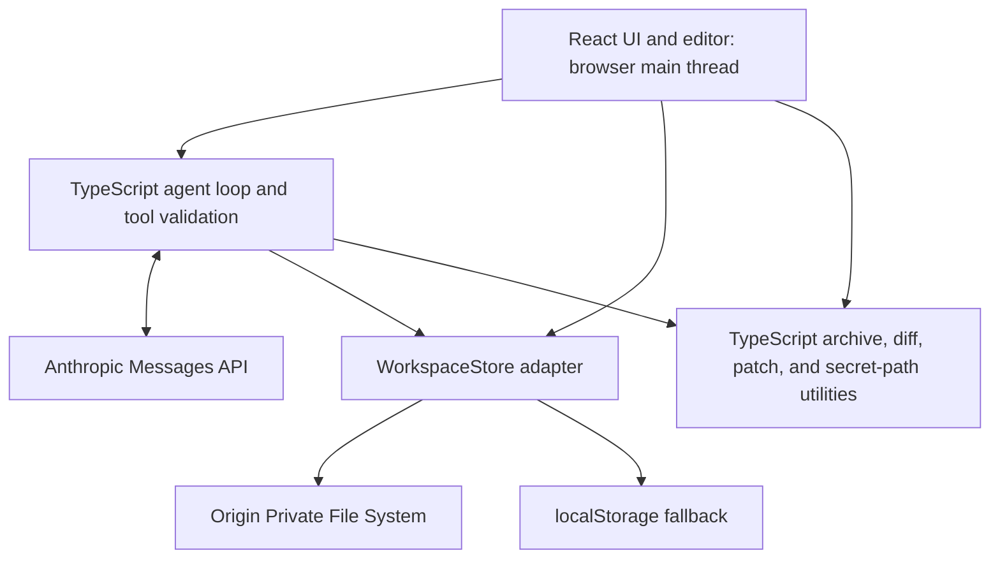
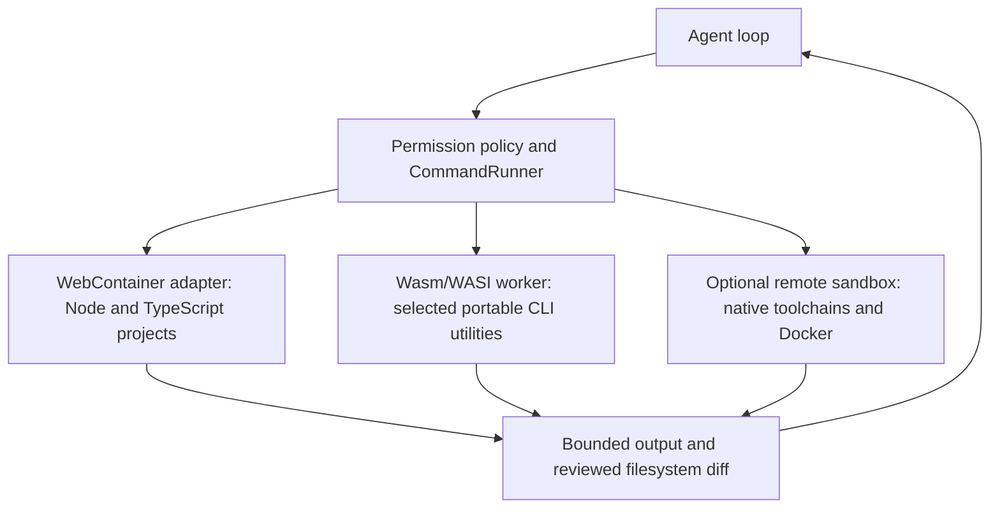

# WasmHatch Project Plan

> A browser-native, local-first React and TypeScript coding workspace.

- Status: Active alpha
- Updated: 2026-07-12
- Repository: <https://github.com/haya-inc/wasmhatch>

## 1. Overview

WasmHatch is an open-source coding workspace that runs primarily in the browser.
Its initial wedge is the path from a small public GitHub issue to a reviewable,
exportable patch without requiring a native installation. It does not compete
for full IDE or Claude Code parity in the first release.

The initial model provider is Anthropic. Users bring their own API key (BYOK),
and their workspace is stored locally in browser-managed storage by default.
The architecture should not prevent adding other model providers later.

WasmHatch does not attempt to compile the Claude Agent SDK itself to
WebAssembly. Instead, it implements an agent loop using the Claude Messages API
and executes client tools inside the browser.

The current alpha does **not** ship WebAssembly, Rust, a Web Worker, or a command
runtime. The React UI, agent loop, filesystem adapters, archive handling, diff,
and patch logic all run as TypeScript on the browser main thread. The production
CSP deliberately sets `worker-src 'none'`. WebAssembly and workers are optional
future optimizations, not claims about the current product.

## 2. Product principles

1. **Local-first**: project files remain on the user's device unless a tool call
   requires selected content to be sent to the model API.
2. **BYOK**: users provide their own API key. WasmHatch does not operate a
   shared model gateway in the initial release.
3. **Explicit capabilities**: the model can only perform operations exposed as
   typed tools.
4. **Reviewable changes**: current model writes stop at a visible proposal; any
   future destructive capability must preserve explicit review.
5. **Browser-native**: installation-free usage is the default experience.
6. **Simple core**: storage uses an adapter today; new abstraction layers require
   a second concrete implementation rather than speculation.
7. **Provider transparency**: Anthropic is hard-coded today. Adding a second
   provider is the trigger for a provider interface.
8. **No false affiliation**: the project must clearly state that it is not an
   official Anthropic or Claude product.

## 3. Goals

### 3.1 Current alpha scope

- Import a bounded public GitHub repository or zip archive.
- Persist a working tree and patch baseline in OPFS, with a `localStorage`
  fallback.
- Edit text files manually and export a unified patch or zip archive.
- Let Claude request bounded `list_files` and `read_file` tools and stage one
  complete-file `propose_file` result for explicit review.
- Keep the API key in React state for the current tab only.
- Display model-bound data, request usage, token budgets, and failure states.
- Exercise the complete review flow without a model API key.

### 3.2 Deferred or excluded from the current alpha

- Running the Claude Agent SDK or Claude Code native executable in Wasm.
- Shipping WebAssembly, Rust crates, Web Workers, or a command runtime without a
  measured need and a reviewed architecture decision.
- Reproducing Claude Code's private prompts or implementation details.
- Supporting arbitrary native binaries, Docker, or every programming language.
- Perfect shell or POSIX filesystem compatibility.
- Persisting API keys for automatic sign-in.
- Full browser parity from the first alpha.
- Silent execution of destructive operations.
- Requiring a vendor-hosted command runtime for the core edit-review-export
  workflow.

### 3.3 Longer-term product target

The longer-term target is a permissioned browser coding agent with a Claude
Code-like iteration loop: inspect the repository, run project commands and
tests, observe bounded stdout and stderr, manage cancellable processes, review
filesystem effects, and repeat. This target requires a command-runtime boundary;
it does not require every runtime capability to be implemented in WebAssembly.

## 4. Target user flow

1. The user opens WasmHatch over HTTPS.
2. Browser storage initializes before import and edit actions become available.
3. The user imports a public GitHub repository or zip archive.
4. The user edits manually, runs the no-key demo, or optionally supplies an
   Anthropic API key for the current tab.
5. Claude may request bounded file listing and line-range reads; tool activity is
   shown in the model-egress ledger.
6. A proposed complete-file replacement stops at a visible diff.
7. The user accepts or rejects the proposal, can continue editing, and exports a
   patch or zip for the repository's normal validation and pull-request flow.

Command execution, local-directory write-back, direct commits, and pull-request
creation are not part of this flow today.

## 5. Current architecture

The diagram below describes the current alpha as shipped. Every application component is
TypeScript. There is no worker boundary or Wasm module.



### 5.1 Web UI

- Public GitHub and zip import controls
- Code editor and file tree
- Non-streaming agent status and model-egress ledger
- Staged proposal diff with apply/reject controls
- Storage usage and export controls
- API-key session form

### 5.2 Agent loop

The model client-tool loop runs on the browser main thread in `src/lib/agent.ts`
and is called from `WorkspacePage`. The API key exists in React state for the
current tab. It is not copied into OPFS, `localStorage`, logs, or telemetry.

The app uses browser `fetch` directly rather than the Anthropic SDK and sends the
provider's explicit browser-access header. This does not make the browser a
secret store; BYOK remains an informed trust decision.

### 5.3 Tool validation and policy

The current loop validates model-provided input, protects common credential
paths, bounds file reads and request budgets, and converts results to Messages
API tool results. Its shipped tools are `list_files`, `read_file`, and
`propose_file`; there is no grep, shell, delete, move, or direct-write tool.

Validation and path protection live in TypeScript code, not model prompts.
Prompt instructions cannot grant capabilities that the current module denies.

### 5.4 WebAssembly and worker adoption gate

No WebAssembly or worker artifact is shipped. The name WasmHatch is a project
name, not a statement about the current runtime. Search, diff, archive, parsing,
and agent operations are TypeScript today.

The Claude Code-like target creates a real need for off-main-thread execution.
That need is different from claiming that WebAssembly itself is an operating
system. WebAssembly provides portable sandboxed computation; host interfaces are
still required for files, clocks, networking, processes, terminals, and Git.
WASI standardizes part of that host interface, while a browser runtime such as
WebContainer provides a different, Node-focused process environment.

A Wasm module, worker, or command-runtime adapter may be introduced when all of
these conditions are met:

1. A representative repository task demonstrates the missing capability or a
   repeatable main-thread/portability problem.
2. An adapter spike proves the required commands or utilities and records
   startup time, memory, output limits, cancellation, and browser compatibility.
3. An architecture decision compares the simplest viable alternatives and
   records bundle size, Rust/toolchain maintenance,
   browser support, licenses, memory limits, and failure fallback.
4. CSP changes are narrowly scoped and the browser E2E suite covers worker
   startup failure and the TypeScript fallback.
5. API keys and private source are excluded from Wasm memory and worker messages
   unless a separate threat review explicitly approves the transfer.

Possible benchmark candidates are:

- Recursive text search
- Glob matching and ignore processing
- Diff and patch operations
- Syntax-aware indexing
- Parsers and formatters compiled from Rust
- Selected WASI-compatible command-line utilities

These are evaluation candidates, not claims about shipped code. The network
client does not need to be compiled to Wasm.

### 5.5 Target execution architecture

`CommandRunner` is the durable product boundary. It keeps model permissions,
approval, cancellation, output bounds, and the audit trail independent from a
specific execution engine.



The first adapter should be chosen by the pilot repository workload. A Node or
TypeScript pilot favors WebContainer; a small deterministic portable utility may
favor Wasm/WASI; Python, Rust, native dependencies, or Docker may require an
explicit remote sandbox. Multiple adapters can coexist behind the same policy
boundary.

## 6. Filesystem plan

### 6.1 Storage roles

| Data | Storage | Notes |
| --- | --- | --- |
| Project files | OPFS; `localStorage` fallback | Canonical working tree and baseline |
| Workspace metadata | Active workspace backend | Separate IndexedDB indexes are not implemented |
| Conversation state | Memory only | Compacted during a run; never contains the API key |
| UI preferences | Not persisted | Theme and preference persistence remain optional |
| API key | Memory only | Cleared on reload/tab close |
| Local directory handle | Not stored | Local-directory integration is not implemented |

`localStorage` is only a compatibility fallback for small projects because it
is synchronous, string-only, and small. OPFS supports directories, binary files, asynchronous
access, and fast synchronous file access from dedicated workers.

### 6.2 Workspace layout

The current OPFS adapter keeps the working tree and patch baseline in separate
origin-private directories:

```text
/wasmhatch-workspace/...
/wasmhatch-baseline/...
```

The `localStorage` fallback uses the keys `wasmhatch-workspace-v1` and
`wasmhatch-baseline-v1`. There is no workspace-ID layer, IndexedDB index, or
persisted conversation store.

### 6.3 WorkspaceStore interface

The agent and UI use the shipped `WorkspaceStore` adapter rather than calling
OPFS or `localStorage` directly:

```ts
interface WorkspaceStore {
  readonly backend: "opfs" | "local-storage";
  listFiles(): Promise<string[]>;
  listBaselineFiles(): Promise<string[]>;
  readFile(path: string): Promise<string>;
  readBaselineFile(path: string): Promise<string>;
  writeFile(path: string, content: string): Promise<void>;
  replaceAll(files: WorkspaceFile[]): Promise<void>;
  clear(): Promise<void>;
}
```

Implemented adapters:

- `OpfsWorkspace`: default persistent browser workspace
- `LocalStorageWorkspace`: compatibility fallback

A local-directory or command-runtime adapter remains deferred.

### 6.4 Filesystem invariants

- Normalize all paths to workspace-relative POSIX-style paths.
- Reject absolute paths, NUL bytes, and traversal through `..`.
- Exclude directories such as `node_modules` and build outputs by default.
- Bound archive sizes, file counts, file reads, tool output, and agent requests.
- Keep an import baseline separate from the working tree for patch generation.
- Return ranges or line windows for large files instead of entire contents.
- Treat binary files separately and never decode them as text implicitly.
- Handle `QuotaExceededError` and expose storage usage to the user.

### 6.5 Persistence and recovery

The storage manager reports durability and lets the user request persistent
browser storage where available. WasmHatch explains that site data can still be
removed explicitly and keeps archive export as the external backup path.

```ts
await navigator.storage.persist();
const estimate = await navigator.storage.estimate();
```

Every workspace must support archive export. Autosave does not replace export
or external backup.

### 6.6 Local directory integration

Local-directory integration is not implemented. A future
`showDirectoryPicker({ mode: "readwrite" })` adapter could enable direct access
in supporting browsers, but permission and conflict handling must be designed
before enabling write-back.

Because directory picker support is not uniform, local-directory access is an
enhancement rather than the canonical storage strategy. Archive import/export
is the cross-browser fallback.

## 7. Agent and tool-use plan

### 7.1 Agent loop

The current implementation uses a non-streaming Messages API client-tool loop:

1. Send messages and tool schemas.
2. Read and validate the JSON response.
3. When the response contains `tool_use`, validate each request.
4. Execute bounded read tools locally or stage a proposal.
5. Append the assistant response and `tool_result` blocks.
6. Continue until there are no tool calls, cancellation, or a configured limit.

The manual loop keeps control out of an opaque SDK helper and leaves
cancellation, logging, budgets, and multiple tool results explicit.

### 7.2 Current and deferred tools

| Tool | Permission default | Purpose |
| --- | --- | --- |
| `list_files` | Allow | List bounded directory contents |
| `read_file` | Allow | Read line/range windows |
| `propose_file` | Stage only | Propose one complete file for visible review |

`glob`, `grep`, direct writes, patch application, moves, deletes, commands, and
git tools are not implemented. They require a separate issue, security review,
and testable permission behavior before being added to this table.

Permission policies can later support `allow for this turn`, `allow for this
workspace`, and command-prefix rules. Persistent grants must be visible and
revocable.

### 7.3 Context management

- Never upload the entire workspace by default.
- Let the model request relevant files through tools.
- Bound tool results and provide line ranges for file reads.
- Summarize or compact long conversations without losing pending tool state.
- Keep request, payload, input-token, and output-token budgets.
- Record which file ranges were sent to the model for user inspection.

### 7.4 Provider abstraction

The current loop calls Anthropic directly. A provider-neutral interface remains
a future refactor and should be introduced only when a second provider is being
implemented.

## 8. Claude Code-like command execution plan

No command execution adapter is shipped today. The current contribution flow
does not require one, but the longer-term product target does. "Claude Code-like"
here means the agent can inspect files, run approved commands and tests, read
bounded process output, cancel or time out work, inspect resulting diffs, and
iterate. It does not mean reproducing Anthropic's private implementation.

### 8.1 CommandRunner contract

Before selecting an engine, define and test an adapter contract covering:

- command, arguments, working directory, and a minimal explicit environment;
- user approval before execution and visible command history;
- streamed but bounded stdout and stderr;
- timeout, cancellation, exit code, and abnormal termination;
- process and resource limits appropriate to the adapter;
- filesystem checkpoint, resulting diff, and explicit acceptance of writes;
- network policy and a hard guarantee that the Anthropic API key is not exposed
  to the command environment.

The first vertical slice must run a real pilot repository's test command and
return its exit code and output through this contract.

### 8.2 JavaScript and TypeScript command runtime

WebContainer is a candidate optional command runtime because it provides an
in-browser Node.js environment, filesystem, processes, and package execution.
The core workflow must remain useful without it.

It requires cross-origin isolation and suitable COOP/COEP headers. Any future
deployment enabling it must account for those headers explicitly.

Its production licensing and vendor-hosted engine are separate from the
WasmHatch Apache-2.0 license. An architecture decision record must document
these constraints before the feature is enabled in a public deployment.

### 8.3 Filesystem synchronization

If a command adapter is adopted, OPFS should remain the canonical persisted
workspace. A possible first synchronization design is:

1. Create a checkpoint of the OPFS tree.
2. Mount or copy the required tree into WebContainer.
3. Execute the approved command without exposing the API key.
4. Compute filesystem changes produced by the command.
5. Display the diff and apply accepted changes back to OPFS.
6. Persist the updated checkpoint.

This is simpler and safer than maintaining two continuously writable sources of
truth. Incremental synchronization can be added after correctness is proven.

### 8.4 Wasm/WASI utilities

Small, deterministic utilities can be compiled to Wasm/WASI and run without a
full Node.js environment. Good candidates include search, formatting, parsing,
and project-specific validators. Run them in a worker so CPU work and blocking
WASI-style calls do not freeze the React UI. Wasm is an execution format and
isolation boundary here, not a replacement for the `CommandRunner` policy.

### 8.5 Future remote sandbox

Languages and workflows that require native toolchains, Docker, or operating
system services may use an optional remote sandbox in the future. It must be a
separate adapter and an explicit user choice. Browser-local operation remains
the default.

## 9. Security model

### 9.1 Primary threats

- API-key theft through XSS, compromised dependencies, logs, or user code
- Malicious repository instructions and prompt injection
- Path traversal and writes outside the workspace
- Destructive or unexpected tool calls
- User code accessing privileged application state
- Command output or file content leaking secrets to the model
- Resource exhaustion through storage, search, command, or agent loops
- Preview applications escaping their intended origin or iframe sandbox

### 9.2 Current controls

- Keep the API key only in React state for the current tab and never persist it.
- Send model traffic only to an explicit provider allowlist.
- Use a strict Content Security Policy and minimize third-party runtime scripts.
- Pin dependencies and review supply-chain changes.
- Redact authorization headers and file content from diagnostics.
- Disable third-party telemetry by default; never send secrets to telemetry.
- Validate every tool input independently of the model response.
- Normalize and confine all filesystem paths.
- Stage model-proposed writes behind an explicit diff and apply/reject decision.
- Limit archive size, file count, read ranges, request bytes, tokens, and turns.
- Provide `clear workspace` and `export before delete` flows. An explicit
  `clear API key` control remains open as good-first Issue #5.

If Wasm or workers are introduced, they must be treated as capability boundaries,
not secret vaults. JavaScript host code controls Wasm memory and imports, and
worker messages create another data-transfer surface.

## 10. Browser support strategy

### 10.1 Initial target

The alpha targets current desktop Chromium browsers for the most reliable OPFS,
file download, and storage-management behavior. The current core does not depend
on SharedArrayBuffer, cross-origin isolation, WebContainer, or Web Workers.

### 10.2 Progressive enhancement

- OPFS workspace: default where available
- Local directory picker: planned, not implemented
- Archive import/export: implemented fallback
- WebContainer commands: deferred and not bundled
- Web Workers: disabled by the production `worker-src 'none'` policy
- Editing and agent tools: remain usable without command execution

The production hostname, scheme, and port should remain stable because browser
storage is scoped to the web origin.

## 11. Current repository structure

```text
wasmhatch/
├── src/
│   ├── pages/               # React landing page and workspace
│   ├── lib/                 # TypeScript agent, storage, import, diff, and policy
│   └── data/                # Revision-pinned example and contribution tasks
├── e2e/                     # Playwright task-to-patch browser contract
├── public/                  # Static badge, social preview, and crawler files
├── scripts/                 # Built-output security verification
├── docs/                    # Plan, landscape, and adoption playbook
├── vite.config.ts           # Build, hosting base, and CSP
└── package.json             # React/TypeScript application dependencies
```

There is no monorepo package split and no `crates/` directory. A package or Rust
workspace should be added only when a shipped feature creates an ownership or
toolchain boundary that the current structure cannot express cleanly.

## 12. Delivery milestones

### Milestone 0: Public foundation — complete

- Apache-2.0 license, README, contribution guide, code of conduct, and security
  policy
- React/TypeScript/Vite project, tests, production build, dependency audit, and
  CI
- Product page with an explicit trust model and live sample-workspace CTA

Exit evidence: a new contributor can install, test, build, and open the project
from documented commands.

### Milestone 1: Repository-to-patch vertical slice — complete

- OPFS workspace with a localStorage fallback
- Public GitHub and zip import with file-count and size bounds
- Editing, persistence, and zip export
- No-key deterministic demo
- Anthropic Messages API loop with `list_files`, `read_file`, and staged
  `propose_file`
- Visible diff with explicit apply/reject controls

Exit evidence: the sample task produces a staged patch, the user approves it,
and the changed file survives reload.

### Milestone 2: Shareable contribution workflow — in progress

- Complete and document `repo`, `ref`, and `task` deep links — complete
- Publish an `Open in WasmHatch` badge and URL builder — complete
- Add persistent baseline snapshots and patch-file export — complete
- Add deterministic fixtures for agent tool-call failures and limits — complete
- Add three real small OSS example tasks — complete
- Publish the first revision-pinned `good first issue` with a direct WasmHatch task link — complete
- Preserve validated GitHub Issue context through patch export and handoff — complete
- Publish a branded social preview with canonical share metadata — complete
- Publish a source-backed product landscape and adoption decision guide — complete
- Land the first external contribution through issue #1 and PR #2 — complete
- Replace the completed task with revision-pinned `good first issue` #4 — complete
- Land the second external contribution through issue #4 and PR #10 — complete
- Replace the completed task with revision-pinned `good first issue` #11 — complete
- Publish five parallel, revision-pinned newcomer tasks and a claim board — complete
- Publish an opt-in external-repository adoption registry without third-party telemetry — complete
- Prepare a source-guided, anti-spam launch and response playbook — complete
- Automate the revision-pinned task-link to patch-download browser path — complete

Exit condition: an external repository can link to a focused task and a new
visitor can export a patch in under three minutes.

### Milestone 3: Alpha hardening

- Add CSP and production hosting headers — strict meta CSP complete; custom
  response headers remain unavailable on GitHub Pages
- Add workspace deletion, storage usage, and export-before-delete flows — complete
- Add archive fuzzing, accessibility tests, and browser capability tests —
  archive fuzzing, capability tests, and modal keyboard checks complete;
  broader automated accessibility coverage remains in progress
- Add conversation compaction, file-range reads, and cost limits — complete
- Add agent-run cancellation — complete
- Add secret-file exclusions and a visible model-egress ledger — complete
- Align public architecture claims with the shipped React/TypeScript main-thread
  runtime and production CSP — complete

Exit condition: the public alpha has documented failure modes and no known
critical trust-boundary gaps.

### Milestone 4: Claude Code-like execution foundation

- Define `CommandRunner` permissions, cancellation, bounded output, audit, and
  filesystem-diff contracts
- Run one real pilot repository's test command through a feature-flagged adapter
- Evaluate WebContainer for Node/TypeScript projects and fully open Wasm/WASI
  alternatives for selected portable utilities
- Evaluate a worker or Wasm utility only after the Section 5.4 adoption gate is met
- Document runtime licenses, network egress, lifecycle scripts, and secret-file
  handling before enabling commands
- Add `showDirectoryPicker` with conflict detection and safe write-back

Exit condition: an approved command can run against a pilot repository, return
bounded output and an exit code, be cancelled, keep the API key inaccessible,
and expose every filesystem effect for review. The existing repository-to-patch
flow must continue to work when the adapter is unavailable.

## 13. Testing strategy

- Unit tests for path normalization, permission policy, tool schemas, diff, and
  tool-result bounds
- Contract tests for the `WorkspaceStore` behavior shared by OPFS and fallback paths
- Integration tests for OPFS using real browser contexts
- Agent-loop fixtures for sequential, parallel, failed, and cancelled tools
- End-to-end tests currently cover task context, zip import, edit persistence,
  proposal conflicts, and patch download. Reload and command cases remain future
  work; command tests apply only if a runtime is adopted.
- Security regression tests for traversal, oversized output, malicious names,
  command injection, and secret redaction
- Browser capability tests for OPFS and persistence; add worker, directory-picker,
  SharedArrayBuffer, and WebContainer tests only when those features are adopted

## 14. Initial decisions

| Decision | Choice |
| --- | --- |
| Project name | WasmHatch |
| Distribution | Open source |
| OSS license | Apache-2.0 |
| Primary experience | Browser-native and local-first |
| Model credentials | User-provided API key |
| Initial provider | Anthropic |
| API-key persistence | None; memory only |
| Canonical workspace | OPFS |
| Workspace metadata | Stored with the active workspace backend |
| `localStorage` usage | Full workspace fallback when OPFS is unavailable |
| Local folder access | Not implemented; possible File System Access adapter |
| Agent implementation | Main-thread TypeScript Messages API client-tool loop |
| Initial frontend | React, TypeScript, Vite, plain CSS |
| Command runtime | Not implemented; required for the longer-term Claude Code-like target |
| Web Worker | Not shipped; production CSP sets `worker-src 'none'` |
| WebAssembly / Rust | Not shipped; planned for selected utilities after the Section 5.4 gate |
| Initial browser target | Desktop Chromium |

## 15. Success metrics

- Across at least 10 opt-in pilot reports, median time from opening a task link
  to the first staged diff is under three minutes.
- At least 20 external repositories trial the workflow and 10 publish a task
  link or badge, tracked through adoption registry issue #9.
- At least 30% of those reported pilot sessions reach patch or zip export.
- Five external contributors land a change before the first beta — progress: 2/5
  through PRs #2 and #10.
- No confirmed API-key persistence or workspace-loss defect remains open.
- The primary flow completes without a command runtime.

## 16. Open questions

- How should model availability be discovered without hard-coding a single
  default forever?
- Which write operations can eventually be auto-approved safely?
- How should WebContainer-generated changes be synchronized efficiently after
  the initial snapshot-based implementation?
- Should patch export precede browser-native git, and what minimum git metadata
  is necessary for issue-to-patch workflows?
- What is the minimum supported project size for the first alpha?
- Should the project offer opt-in, privacy-preserving diagnostics?
- When should a remote sandbox adapter be considered?

## 17. References

- [Anthropic TypeScript SDK](https://platform.claude.com/docs/en/cli-sdks-libraries/sdks/typescript)
- [How Claude tool use works](https://platform.claude.com/docs/en/agents-and-tools/tool-use/how-tool-use-works)
- [Anthropic Tool Runner](https://platform.claude.com/docs/en/agents-and-tools/tool-use/tool-runner)
- [Origin Private File System](https://developer.mozilla.org/en-US/docs/Web/API/File_System_API/Origin_private_file_system)
- [File System API](https://developer.mozilla.org/en-US/docs/Web/API/File_System_API)
- [`showDirectoryPicker`](https://developer.mozilla.org/en-US/docs/Web/API/Window/showDirectoryPicker)
- [Browser storage quotas and eviction](https://developer.mozilla.org/en-US/docs/Web/API/Storage_API/Storage_quotas_and_eviction_criteria)
- [WebContainer API](https://webcontainers.io/api)
- [WebContainer header configuration](https://webcontainers.io/guides/configuring-headers)
- [WebContainer commercial usage](https://webcontainers.io/enterprise)
- [OSS adoption playbook](launch-playbook.md)
