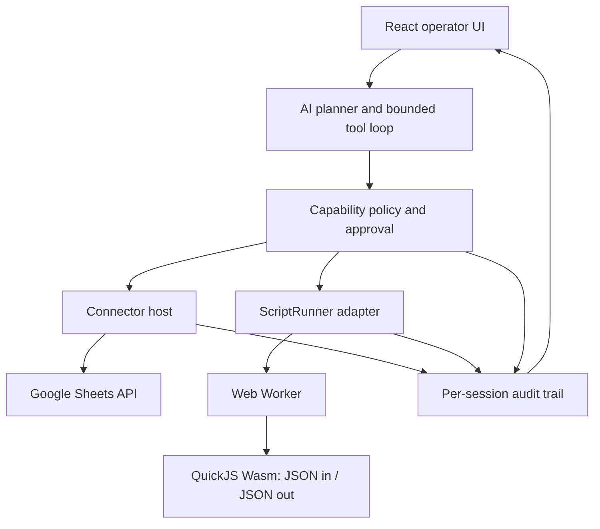

# WasmHatch Product Plan

> A browser-native AI operator for visible, permissioned business work.

- Status: Direction reset; foundation slice in progress
- Updated: 2026-07-12
- License: Apache-2.0
- Primary deployment: static web application

## 1. Product definition

WasmHatch is not a coding assistant or a browser IDE. It is an AI operations
workspace that can read business data through typed connectors, decide which
bounded tools to use, create a short transformation script when necessary, and
stage external effects for review.

The initial use case is spreadsheet work:

1. Read a bounded range from Google Sheets or a local workbook.
2. Let an AI planner inspect the schema and choose a transformation.
3. Run generated data-processing code in a resource-limited Wasm sandbox.
4. Show the exact changed cells and destination.
5. Write only after the user approves the proposed effect.

The product is browser-first, not browser-only at any cost. The foreground
alpha works without a WasmHatch server. Background schedules, refresh-token
storage, webhooks, service accounts, and APIs without browser CORS support will
require a separately deployed server adapter.

## 2. Current implementation truth

### 2.1 Shipped foundation slice

- A new business-operator landing page and `/operator` application route.
- A local spreadsheet demo with editable tabular data.
- A `GoogleSheetsConnector` that reads and writes Sheets API value ranges.
- Access tokens held in connector memory and excluded from script input.
- A provider-neutral `BusinessPlanner` boundary and OpenAI Responses API
  adapter for natural-language spreadsheet transformation plans.
- Strict function-call output that stages a summary, expected effect,
  assumptions, warnings, and synchronous script without executing it.
- Explicit model egress: the planning action sends only the visible task and a
  bounded range; model and connector credentials stay in session memory.
- A QuickJS runtime compiled to Wasm and loaded inside a Web Worker.
- Synchronous JSON-to-JSON transformation scripts with CPU, memory, source,
  input, and output limits.
- A cell-level write preview with explicit apply/reject controls.
- A per-tab audit trail for reads, script execution, and approved writes.

### 2.2 Not implemented yet

- Google OAuth authorization UI; the foundation screen accepts a development
  access token for manual testing.
- A multi-step AI tool loop that can request connector reads, run more than one
  transform, or revise a plan from tool results.
- Local XLSX/CSV import in the operator surface.
- Persisted workflows, schedules, webhooks, or background execution.
- Refresh tokens, service accounts, team credential vaults, or organization
  administration.
- Excel/Microsoft Graph and non-spreadsheet connectors.

### 2.3 Legacy surface

The earlier GitHub issue-to-patch coding workspace remains available at
`?view=workspace` while reusable storage, cancellation, budget, and audit code
is migrated. It is no longer the product direction and receives no new product
features.

## 3. Product principles

1. **Effects are first-class**: every external write has a typed destination,
   bounded payload, preview, approval state, and audit record.
2. **Credentials are capabilities, not context**: OAuth tokens belong to a
   connector host. They are never included in model messages or generated
   script input.
3. **Scripts transform data**: sandbox code receives JSON-compatible values and
   has no direct `fetch`, DOM, browser storage, or connector access.
4. **AI chooses tools, policy grants them**: model output cannot expand scopes,
   skip validation, or silently authorize a write.
5. **Foreground first**: the first release runs only while the user is present
   in the tab. This keeps the credential and autonomy model understandable.
6. **Local inspection**: the user can see model-bound data, connector calls,
   generated code, script results, proposed writes, and final outcomes.
7. **Adapters over lock-in**: connectors, model providers, script engines, and
   future background runners use explicit interfaces.

## 4. User flow

1. The user opens WasmHatch and chooses a connector or local workbook.
2. The connector requests the narrowest usable scope for the current session.
3. The user describes a business outcome, such as normalizing a sales sheet.
4. The planner requests a bounded range through a typed read tool.
5. The planner may generate a synchronous JSON transformation function.
6. WasmHatch runs the function inside the Wasm Worker without credentials or
   network access.
7. The planner proposes a connector write with a range and resulting values.
8. WasmHatch displays cell-level changes and destination details.
9. The user approves or rejects the write.
10. The connector performs the approved request and records the result.

Repeated low-risk actions may later receive revocable policy grants. The alpha
does not persist grants or run unattended.

## 5. Architecture



### 5.1 Connector host

Connectors own authorization state and translate typed operations to external
APIs. A connector is not exposed as an unrestricted HTTP client.

```ts
interface SpreadsheetConnector {
  readonly id: string;
  readonly label: string;
  read(request: SpreadsheetRange, signal?: AbortSignal): Promise<SpreadsheetSnapshot>;
  write(request: SpreadsheetWrite, signal?: AbortSignal): Promise<SpreadsheetWriteResult>;
}
```

Initial Google Sheets operations:

- `read_range(spreadsheetId, range)`
- `propose_write_range(spreadsheetId, range, values, inputMode)`
- `execute_approved_write(proposalId)`

The planner-facing tool must stage a proposal rather than calling `write`
directly. The current foundation UI invokes the connector after a local review;
the proposal-ID boundary is the next implementation step.

### 5.2 Script runner

The script contract is deliberately smaller than a shell:

```ts
type Transform = (input: JsonValue) => JsonValue;
```

Current runtime properties:

- QuickJS 2025-04-26 through `quickjs-emscripten-core` 0.32.0 and the
  release-sync Wasm variant (MIT)
- Wasm execution inside a module Worker
- 750 ms execution deadline
- 32 MB QuickJS memory limit
- 512 KB input and output limits
- 24 KB source limit
- 512 KB stack limit
- no host functions, network, DOM, OPFS, OAuth token, or model client
- synchronous functions only

This is sufficient for filtering, mapping, normalization, joins over bounded
data, derived columns, validation, and report shaping. Pyodide or DuckDB-Wasm
may be added as separate runners when pilot workloads demonstrate a need.

### 5.3 AI planner

The business surface now defines a provider-neutral `BusinessPlanner` and an
`OpenAIPlanner` adapter. The first slice calls the Responses API with one forced,
strict function tool. The model receives the task and currently visible rows,
then may only stage:

- a plain-language summary;
- the expected cell-level effect;
- reviewer assumptions and warnings; and
- a synchronous JSON transformation function.

The request sets `store: false`, permits one non-parallel function call, and
defaults to `gpt-5.6-luna` with low reasoning effort. The OpenAI API key is sent
only in the Authorization header. The staged function remains editable and does
not run until the user separately selects **Run in Wasm sandbox**. A successful
run still cannot write until the write-review approval.

The adapter validates task, range, response, list, and script-size bounds even
when the API used strict output. This follows OpenAI's current recommendation to
use function calling when a model bridges application tools and to enable strict
mode for schema adherence:

- https://developers.openai.com/api/docs/guides/function-calling
- https://developers.openai.com/api/docs/guides/structured-outputs

The next planner tool set is:

| Tool | Effect | Default policy |
| --- | --- | --- |
| `list_connectors` | Read metadata | Allow |
| `describe_spreadsheet` | Read metadata | Allow after connector grant |
| `read_spreadsheet_range` | Model egress | Ask on first range |
| `run_transform_script` | Local computation | Allow within limits |
| `propose_spreadsheet_write` | Stage external effect | Stage only |
| `execute_approved_write` | External mutation | User approval required |

Tool results must contain bounded data plus provenance: connector ID,
spreadsheet ID alias, range, row and column counts, and byte size.

### 5.4 Storage

OPFS remains useful for:

- local workbook snapshots;
- workflow drafts and generated scripts;
- reversible write proposals;
- audit export;
- cached connector metadata without credentials.

OAuth access and refresh tokens are never stored in OPFS or `localStorage`.
Formal OAuth support must use browser session memory for the foreground alpha.
The development OpenAI API key follows the same memory-only rule. It is never
placed in model input, script input, URLs, logs, or browser storage.

## 6. Browser-only and server-backed modes

### 6.1 Foreground browser mode — initial product

- User keeps the tab open.
- OAuth uses a public browser client and short-lived access token.
- Supported APIs must allow browser-origin requests.
- Model access is bring-your-own-key in the alpha; the key remains in memory and
  requests are sent directly from the foreground tab.
- Scripts run locally.
- Every write requires approval.
- No WasmHatch account or server is required.

Google publishes a JavaScript web-app quickstart for direct Sheets API access,
so Google Sheets is the first connector:
https://developers.google.com/workspace/sheets/api/quickstart/js

### 6.2 Optional server adapter — future

A server becomes necessary for:

- refresh-token or service-account storage;
- schedules and work that continues after tab close;
- inbound webhooks;
- APIs requiring client secrets or lacking CORS;
- large/long-running workloads;
- organization-wide policies and durable audits.

The server is a connector and scheduler host, not a requirement for the local
operator. A self-hostable implementation is preferred before any hosted-only
offering.

## 7. Security model

### 7.1 Primary threats

- Model or prompt injection requesting excessive business data.
- Generated scripts attempting network or browser access.
- OAuth-token disclosure to model context, script input, logs, or storage.
- Spreadsheet formula injection and unexpected formula interpretation.
- Writes to the wrong spreadsheet, sheet, range, or account.
- Large ranges or scripts exhausting browser resources.
- Approval fatigue caused by unclear or overly broad previews.
- Third-party connector or script-package supply-chain compromise.

### 7.2 Required controls

- Keep credentials in connector memory and redact authorization headers.
- Use narrow OAuth scopes and display the active identity and account.
- Validate range, cell type, row count, column count, and payload size.
- Keep model egress separate from connector egress in the audit trail.
- Execute generated scripts without host imports.
- Terminate workers on cancellation or wall-clock timeout.
- Show the connector, destination, range, and changed cells before write.
- Treat formula writes as a separate high-risk capability.
- Require a fresh proposal if source data changes before approval.
- Keep CSP allowlists connector-specific; do not add a generic network wildcard.

## 8. OSS landscape and position

Relevant projects validate the category:

- Activepieces provides an MIT community edition, typed TypeScript connector
  pieces, AI agents, code steps, MCP exposure, and self-hosting:
  https://github.com/activepieces/activepieces
- Windmill turns scripts into workflow and AI-agent tools with approvals and
  self-hosted execution:
  https://www.windmill.dev/docs/core_concepts/ai_agents
- Google Apps Script demonstrates that spreadsheet users value programmable
  automation close to their data, but it is tied to Google's hosted runtime.

WasmHatch should not compete on connector count or background orchestration.
Its initial wedge is:

1. No server or account for foreground work.
2. Credentials excluded from model and script contexts.
3. Generated logic runs locally in a Wasm sandbox.
4. External effects receive a cell-level review.
5. The entire reasoning/tool/effect trail is inspectable.

## 9. Delivery milestones

### Milestone 0: Direction reset — complete

- Replace coding-assistant positioning with business-operator positioning.
- Preserve the legacy coding workspace behind its existing route.
- Document the foreground browser trust boundary and future server boundary.

### Milestone 1: Spreadsheet foundation — in progress

- Add Google Sheets value-range connector — complete.
- Add QuickJS/Wasm Worker with resource limits — complete.
- Add cell-level transform preview and approval — complete.
- Add foundation operator UI and local demo — complete.
- Add Google Identity Services OAuth flow.
- Add local CSV/XLSX import and export.
- Add stale-source precondition before an approved write.

Exit condition: a user signs in, reads a bounded range, runs a local transform,
reviews exact cell changes, and writes the approved values without a credential
entering model or script input.

### Milestone 2: AI-directed operation

- Implement the provider-neutral planner boundary — complete.
- Add an OpenAI Responses API planner with strict staged output — complete.
- Let the model inspect an explicitly sent, already-granted range — complete.
- Let the model generate a bounded transform function for separate review and
  execution — complete.
- Implement the multi-step business tool registry and loop.
- Stage model-proposed writes behind immutable proposal IDs.
- Display model egress, script source, tool calls, and write results together.
- Add cancellation, request budgets, and retry behavior to the new loop.

Exit condition: the agent completes the spreadsheet workflow from a natural
language task while every capability remains independently enforceable.

### Milestone 3: Five business pilots

- Recruit five Haya workflows rather than five coding contributors.
- Measure time-to-reviewed-result, manual steps removed, corrections required,
  and whether the user trusted the write preview.
- Include at least one failed or rejected operation in the evidence set.
- Use pilot demand to choose the second connector and second script runtime.

Candidate pilots:

1. Normalize a weekly sales pipeline.
2. Deduplicate a customer or partner list.
3. Reconcile two spreadsheet exports.
4. Enrich a sheet from a bounded business API.
5. Produce a summarized report in a new sheet.

### Milestone 4: Optional background adapter

- Define refresh-token, scheduling, webhook, retention, and tenant boundaries.
- Publish a self-hostable connector/scheduler service.
- Keep browser-only workflows functional without the service.
- Require explicit migration of credentials from foreground to durable mode.

## 10. Success metrics

The coding-contributor metric is retired. Initial product evidence is:

- 5 real Haya business workflows attempted.
- 3 workflows reach an approved external write.
- Median time from task entry to reviewed proposal under 5 minutes.
- Zero credentials observed in model messages, script inputs, logs, or storage.
- Every external write maps to a visible proposal and user approval.
- At least 2 pilot users repeat the workflow in a later session.

## 11. Immediate next issues

1. Immutable spreadsheet write proposals with source snapshot hashes.
2. Google Identity Services OAuth with narrow Sheets scopes.
3. Expand the staged planner into a bounded multi-step business tool loop.
4. CSV/XLSX import into the same `SpreadsheetRows` contract.
5. Audit export suitable for a pilot review.
6. Replace the existing public pilot and contribution messaging.
