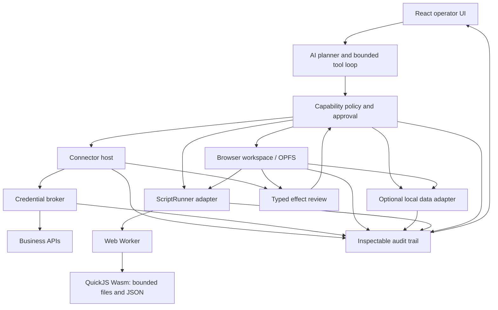

# WasmHatch Product Plan

> A browser-native AI operator for visible, permissioned business work.

- Status: Direction reset; foundation slice in progress
- Updated: 2026-07-12
- License: Apache-2.0
- Primary deployment: static web application

## 1. Product definition

WasmHatch is not a coding assistant or a browser IDE. It is an AI operations
workspace that can read business data through typed connectors, keep inspectable
artifacts in a browser-local filesystem, create and run bounded transformation
scripts, and stage every durable effect for review. Embedded query engines may
accelerate proven workloads, but they are not part of the product definition.

The initial use case is spreadsheet work:

1. Read a bounded range from Google Sheets or a local workbook.
2. Let an AI planner inspect the schema and choose a transformation.
3. Run generated data-processing code in a resource-limited Wasm sandbox.
4. Show the exact changed cells and destination.
5. Write only after the user approves the proposed effect.

The spreadsheet is the first structured workbench, not the product boundary.
Markdown, CSV, JSON, generated scripts, connector snapshots, reports, and—when
an embedded engine is promoted—database tables become first-class workspace
artifacts. The same proposal and approval model applies to local file changes,
optional database mutations, document creation, calendar changes, task updates,
and outbound communication.

The product is browser-first, not browser-only at any cost. The foreground
alpha works without a WasmHatch server. Background schedules, refresh-token
storage, webhooks, service accounts, and APIs without browser CORS support will
require a separately deployed server adapter.

## 2. Current implementation truth

### 2.1 Shipped foundation slice

- A new business-operator landing page and `/operator` application route.
- A local spreadsheet demo with editable tabular data.
- Versioned manifests for the local spreadsheet and Google Sheets connectors,
  with strict schema and core-compatibility validation.
- A credential broker that keeps access tokens outside connector code and adds
  authorization only after validating operation, origin, method, path, query,
  headers, and byte limits.
- A `GoogleSheetsConnector` that reads and writes through the broker-bound
  transport rather than receiving a raw token or authenticated `fetch`.
- A Google Identity Services token-model host with session-only credentials,
  expiry margin, typed denial/popup/timeout errors, explicit reauthorization,
  account-switch invalidation, and grant revocation. See
  [Google Sheets OAuth](google-oauth.md).
- A provider-neutral `BusinessPlanner` boundary and OpenAI Responses API
  adapter for natural-language spreadsheet transformation plans.
- Strict function-call output that stages a summary, expected effect,
  assumptions, warnings, and synchronous script without executing it.
- Explicit model egress: the planning action sends only the visible task and a
  bounded range; model and broker credentials stay in session memory.
- A QuickJS runtime compiled to Wasm and loaded inside a Web Worker.
- Synchronous JSON-to-JSON transformation scripts with CPU, memory, source,
  input, and output limits.
- Content-addressed, deeply frozen spreadsheet proposals that bind connector
  version, target, base snapshot, typed mutations, summary, and policy decision.
- A strict typed mutation bundle from which preview, summary, commit values, and
  inverse receipt metadata are generated rather than stored independently.
- Structural table changes fail as an explicit unsupported effect. Formula
  writes under `USER_ENTERED` are classified separately and blocked until a
  dedicated high-risk capability exists.
- A cell-level write preview with exact proposal approval/rejection controls.
  See [Tabular Mutations](tabular-mutations.md).
- A source-range `recheck` immediately before local or Google Sheets commit;
  stale proposals become visible conflicts and never write.
- A provider-native conditional-write contract for `atomic` ETag, revision, or
  sequence checks, validated with an in-memory connector; Google Sheets values
  updates do not claim this guarantee.
- Terminal `uncertain` handling for transport, unreadable success, timeout, and
  server failures after a write may have been sent; no automatic retry.
- A per-tab audit trail for reads, proposal preparation, conflicts, uncertain
  outcomes, rejections, and committed receipts.

### 2.2 Not implemented yet

- A bundled production Google OAuth client, public sensitive-scope verification,
  Google Picker/`drive.file`, and active account email display. The foreground
  flow accepts deployer or user-provided Web client ID configuration.
- A multi-step AI tool loop that can request connector reads, run more than one
  transform, or revise a plan from tool results.
- Local XLSX/CSV import in the operator surface.
- Persisted workflows, schedules, webhooks, or background execution.
- Refresh tokens, service accounts, team credential vaults, or organization
  administration.
- Excel/Microsoft Graph and non-spreadsheet connectors.

### 2.3 Legacy surface

The earlier GitHub issue-to-patch coding workspace remains available at
`?view=workspace` while reusable storage, cancellation, budget, and audit code
is migrated. It is no longer the product direction and receives no new product
features.

## 3. Product principles

1. **Effects are first-class**: every external write has a typed destination,
   bounded payload, preview, approval state, and audit record.
2. **Credentials are capabilities, not context**: OAuth tokens belong to a
   connector host. They are never included in model messages or generated
   script input.
3. **Scripts transform data**: sandbox code receives JSON-compatible values and
   has no direct `fetch`, DOM, browser storage, or connector access.
4. **AI chooses tools, policy grants them**: model output cannot expand scopes,
   skip validation, or silently authorize a write.
5. **Foreground first**: the first release runs only while the user is present
   in the tab. This keeps the credential and autonomy model understandable.
6. **Local inspection**: the user can see model-bound data, connector calls,
   generated code, script results, proposed writes, and final outcomes.
7. **Adapters over lock-in**: connectors, model providers, script engines, and
   future background runners use explicit interfaces.
8. **Files stay legible**: user-authored knowledge, instructions, intermediate
   data, and outputs prefer inspectable Markdown, CSV, JSON, and script files
   over opaque application-only state.
9. **Databases, if adopted, accelerate files; they do not hide them**: an
   embedded engine may provide indexing, joins, and transactional metadata,
   while user artifacts remain exportable and schemas and mutations remain
   inspectable.
10. **Execution is capability-scoped**: file access, database access, script
    execution, connector calls, and network access are independent permissions.

### 3.1 Commitment levels

This plan distinguishes product commitments from candidates. Reference OSS is
evidence, not a template; see [OSS Design Study](oss-design-study.md).

| Area | Official status | Decision |
| --- | --- | --- |
| Effect protocol: prepare, immutable proposal, approval, base-version check, commit receipt | **Committed** | Core safety architecture; implement before broader autonomy |
| Script boundary: saved source, granted input snapshot, ephemeral output, diff review, no live capabilities | **Committed** | Core execution invariant for every script runner |
| P0 CSV/XLSX and Google Sheets | **Committed** | First useful local/external data loop |
| Browser workspace artifact model | **Committed, thin slice first** | OPFS-backed Markdown/CSV/JSON/JavaScript, manifests, proposals, and export; UI breadth follows evidence |
| Google Drive/Docs and Calendar | **Pilot-gated candidate** | Implement the first connector with repeated demand; do not promise both in advance |
| Linear task-system connector | **Pilot-gated browser candidate** | PKCE and browser CORS are feasible; promote only after repeated workflow demand |
| Jira task-system connector | **Pilot-gated server candidate** | API CORS exists, but current 3LO token exchange requires a client secret; do not place it on the foreground-browser path |
| Microsoft Graph and Gmail/Outlook mail | **Research candidate** | High auth, tenant, restricted-scope, and outbound-effect cost; no P2 delivery promise yet |
| SQLite-Wasm | **First database spike, not yet a dependency** | Adopt only if it beats a smaller OPFS event/artifact store on recovery and transaction needs |
| DuckDB-Wasm | **Workload-gated analytical adapter** | Add only after representative benchmarks show value |
| PGlite | **Watchlist** | Not part of the official delivery path without a Postgres-specific requirement |
| Optional server adapter | **Interface committed; implementation conditional** | Build only for unattended work or connectors that cannot operate safely in the browser |

“Committed” fixes the behavior and exit condition, not a particular third-party
library. “Pilot-gated” requires observed workflows. “Research candidate” and
“watchlist” must not create implementation work until promoted by a recorded
decision.

## 4. User flow

1. The user opens or creates a browser-local workspace.
2. The user imports local files, selects connector resources, or creates
   Markdown, CSV, JSON, and script artifacts in the workspace.
3. Each connector requests the narrowest usable scope for the current session.
4. The user describes an outcome, such as reconciling two exports and drafting
   follow-up tasks.
5. The planner requests bounded file, range, or connector reads through
   separately governed tools. Database reads use the same boundary if an
   embedded engine has been promoted for the workspace.
6. The planner may create a script proposal and an explicit input/output
   manifest. WasmHatch executes the approved script in a Worker without
   credentials, DOM, live OPFS, or ambient network access.
7. Local file outputs and optional database mutations are staged as diffs.
   External connector changes are staged as typed effects.
8. WasmHatch displays the exact target, changed content or fields, assumptions,
   and stale-source checks.
9. The user approves or rejects each effect or an explicitly grouped set.
10. WasmHatch applies only the approved local and external effects and records
    the results in the workspace audit trail.

Repeated low-risk actions may later receive revocable policy grants. The alpha
does not persist grants or run unattended.

## 5. Architecture



### 5.1 Connector host

The host credential broker owns authorization state. Connectors translate typed
operations into unsigned, manifest-named requests and receive only a frozen
transport with connector ID, connector version, and `request`. Each binding also
names the allowed operations and exact path-placeholder resources. They never
receive token text or an unrestricted authenticated HTTP client.

Each versioned manifest declares core compatibility, auth kind, allowed origins,
operations, effect class, retry class, precondition strength, method, path
template, query/header allowlists, body mode, media types, and request/response
byte limits. The broker
validates the manifest again when binding, validates every request, resolves the
host credential provider, attaches authorization, forbids redirects, and sends
the bounded response. See [Connector Authoring](connector-authoring.md).

```ts
interface SpreadsheetConnector {
  readonly id: string;
  readonly label: string;
  readonly version: string;
  readonly manifest?: ConnectorManifest;
  read(request: SpreadsheetRange, signal?: AbortSignal): Promise<SpreadsheetSnapshot>;
  write(request: SpreadsheetWrite, signal?: AbortSignal): Promise<SpreadsheetWriteResult>;
}
```

Initial Google Sheets operations:

- `read_range(spreadsheetId, range)`
- `propose_write_range(spreadsheetId, range, values, inputMode)`
- `execute_approved_write(proposalId)`

The planner-facing tool stages a content-addressed proposal rather than calling
`write` directly. After exact approval, the effect executor validates the source
and invokes the manifest-bound connector. Local and fixture connectors use the
same versioned contribution contract without requiring application UI.

Only P0 connector delivery is committed. Later rows are ranked hypotheses that
must pass the milestone decision gates:

| Priority | Connector | Initial typed operations | Delivery boundary |
| --- | --- | --- | --- |
| P0 | CSV/XLSX and Google Sheets | import, export, read range, propose range write | Foreground browser |
| P1 candidate | Google Drive / Docs | pick a file, read/export selected content, propose document creation or update | Foreground browser with per-file `drive.file` access; repeated pilot demand required |
| P1 candidate | Google Calendar | list bounded events, free/busy, propose event create or update | Foreground browser; attendee notifications require explicit review; repeated pilot demand required |
| P1 candidate | Linear | read issues, propose issue creation, field update, or comment | Browser PKCE and CORS feasibility confirmed; repeated pilot demand still required |
| Server candidate | Jira | read issues, propose issue creation, field update, or comment | Current 3LO token exchange requires a client secret; promote only with the optional server adapter |
| Research | Microsoft Graph | Outlook, Calendar, OneDrive, and SharePoint reads and typed proposals | Foreground SPA with PKCE where tenant policy permits; no delivery commitment |
| Research | Gmail / Outlook Mail | bounded search/read, classify, draft reply, explicit send | Draft-first; restricted scopes, verification, and send risk require a separate gate |

The roadmap does not imply an unrestricted HTTP tool. Each connector exposes a
small domain schema and a domain-specific review: cell diff, document diff,
calendar before/after, issue field diff, or recipients/subject/body for mail.

### 5.2 Browser workspace and virtual filesystem

The operator will reuse and generalize the existing OPFS-backed `WorkspaceStore`
from the legacy surface. The user sees a file tree even though the files live in
origin-private browser storage. The initial conventional layout is:

```text
inputs/       imported and connector-derived snapshots
work/         editable Markdown, CSV, JSON, and text artifacts
outputs/      generated reports and export-ready files
scripts/      reviewed JavaScript transforms and fixtures
workflows/    Markdown instructions plus machine-readable manifests
.wasmhatch/   proposals, hashes, audit indexes, and optional database files
```

Required workspace operations:

- list, glob, stat, bounded read, and text search;
- create, patch, rename, and delete through a staged filesystem diff;
- CSV schema inspection and row-window reads rather than unbounded prompt input;
- Markdown preview and source editing;
- import/export for individual files and portable workspace archives;
- source hashes and immutable proposal IDs to reject stale writes;
- quota, persistence, fallback, recovery, and multi-tab conflict diagnostics.

The planner-facing file tools follow the useful OpenCode separation of
`read`/`glob`/`grep` from `write`/`edit`/`apply_patch`, but use safer defaults:
reads are bounded and visible in model-egress history, mutations stage a diff,
and no file write is silently approved. OpenClaw's visible Markdown memory and
workspace skill pattern inform `workflows/`, but WasmHatch does not grant those
files authority to expand tool permissions.

### 5.3 Embedded database adapters

Files remain the portable artifact layer. Databases add query, index, join, and
transaction capabilities through a separate `DatabaseAdapter` running in a
Worker:

1. **SQLite-Wasm is the first database spike** for workspace catalog, workflow
   state, audit indexes, structured user tables, and small transactional
   workloads. It becomes a dependency only if the spike proves recovery,
   portability, transaction, and bundle-cost advantages over smaller OPFS files.
2. **DuckDB-Wasm as an analytical adapter** for bounded SQL over CSV, JSON,
   Parquet, and larger local tables when pilot data justifies its bundle cost.
3. **PGlite stays on the watchlist**, not the delivery roadmap, until Postgres
   compatibility, reactive queries, or pgvector materially improves a real
   workflow.

Database tools are typed as `describe_database`, `list_tables`, `query_database`,
`propose_database_mutation`, and `execute_approved_database_mutation`. Read
queries receive row, byte, time, and statement limits. Mutations run in a
transaction, produce a row/schema diff when feasible, and cannot commit until
approved. Dynamic extensions, arbitrary file access, and database-originated
network requests are disabled by default.

### 5.4 Script runner

The script contract is deliberately smaller than a shell:

```ts
type Transform = (input: JsonValue) => JsonValue;
```

Current runtime properties:

- QuickJS 2025-04-26 through `quickjs-emscripten-core` 0.32.0 and the
  release-sync Wasm variant (MIT)
- Wasm execution inside a module Worker
- 750 ms execution deadline
- 32 MB QuickJS memory limit
- 512 KB input and output limits
- 24 KB source limit
- 512 KB stack limit
- no host functions, network, DOM, OPFS, OAuth token, or model client
- synchronous functions only

This is sufficient for filtering, mapping, normalization, joins over bounded
data, derived columns, validation, and report shaping. Pyodide or DuckDB-Wasm
may be added as separate runners when pilot workloads demonstrate a need.

The next script contract adds a bounded virtual mount without exposing live
OPFS. Before execution, the host snapshots explicitly granted input files into
the Worker. The script may read those snapshots and write only to an ephemeral
output directory. The host then validates size, type, and path, and turns the
result into a filesystem proposal. Scripts never receive OAuth credentials,
connector handles, DOM access, browser storage access, or ambient network
access. A script source file and its input/output manifest are saved together so
the run can be inspected and repeated.

QuickJS remains the default JavaScript runner. Pyodide is a later optional
runner for pandas and existing Python workflows; it must implement the same
snapshot, limit, proposal, and audit contract rather than mounting live OPFS.

### 5.5 AI planner

The business surface now defines a provider-neutral `BusinessPlanner` and an
`OpenAIPlanner` adapter. The first slice calls the Responses API with one forced,
strict function tool. The model receives the task and currently visible rows,
then may only stage:

- a plain-language summary;
- the expected cell-level effect;
- reviewer assumptions and warnings; and
- a synchronous JSON transformation function.

The request sets `store: false`, permits one non-parallel function call, and
defaults to `gpt-5.6-luna` with low reasoning effort. The OpenAI API key is sent
only in the Authorization header. The staged function remains editable and does
not run until the user separately selects **Run in Wasm sandbox**. A successful
run still cannot write until the write-review approval.

The adapter validates task, range, response, list, and script-size bounds even
when the API used strict output. This follows OpenAI's current recommendation to
use function calling when a model bridges application tools and to enable strict
mode for schema adherence:

- https://developers.openai.com/api/docs/guides/function-calling
- https://developers.openai.com/api/docs/guides/structured-outputs

The next planner tool set is:

| Tool | Effect | Default policy |
| --- | --- | --- |
| `list_connectors` | Read metadata | Allow |
| `describe_spreadsheet` | Read metadata | Allow after connector grant |
| `read_spreadsheet_range` | Model egress | Ask on first range |
| `run_transform_script` | Local computation | Allow within limits |
| `propose_spreadsheet_write` | Stage external effect | Stage only |
| `execute_approved_write` | External mutation | User approval required |
| `list_workspace_files` | Read metadata | Allow within the active workspace |
| `read_workspace_file` | Model egress | Ask on first file or grant pattern |
| `propose_workspace_patch` | Stage local effect | Stage only |
| `describe_database` | Read metadata | Allow after database grant |
| `query_database` | Model egress | Allow only for bounded read-only SQL |
| `propose_database_mutation` | Stage local effect | Stage only |
| `run_workspace_script` | Local computation | Ask for input manifest; sandboxed |

Tool results must contain bounded data plus provenance: connector ID and
resource alias when external; workspace path and source hash when local; range,
table, or query identity; row and column counts; and byte size.

### 5.6 Storage

OPFS remains useful for:

- the visible browser-local workspace and its baseline;
- Markdown, CSV, JSON, database, script, and report artifacts;
- local workbook and connector snapshots;
- workflow drafts and generated scripts;
- reversible write proposals;
- audit export;
- cached connector metadata without credentials.

OAuth access and refresh tokens are never stored in OPFS or `localStorage`.
Formal OAuth support must use browser session memory for the foreground alpha.
The Google Sheets implementation uses the GIS token model, treats the final 30
seconds as expired, and requires an explicit reconnect gesture. Its sensitive
Sheets scope is broader than the broker's exact spreadsheet/range grant; the UI
discloses that difference and the next per-file authorization spike is
`drive.file` plus Google Picker.
The development OpenAI API key follows the same memory-only rule. It is never
placed in model input, script input, URLs, logs, or browser storage.

## 6. Browser-only and server-backed modes

### 6.1 Foreground browser mode — initial product

- User keeps the tab open.
- OAuth uses a public browser client and short-lived access token.
- Supported APIs must allow browser-origin requests.
- Model access is bring-your-own-key in the alpha; the key remains in memory and
  requests are sent directly from the foreground tab.
- Scripts run locally.
- Every write requires approval.
- No WasmHatch account or server is required.

Google publishes a JavaScript web-app quickstart for direct Sheets API access,
so Google Sheets is the first connector:
https://developers.google.com/workspace/sheets/api/quickstart/js

### 6.2 Optional server adapter — future

A server becomes necessary for:

- refresh-token or service-account storage;
- schedules and work that continues after tab close;
- inbound webhooks;
- APIs requiring client secrets or lacking CORS;
- large/long-running workloads;
- organization-wide policies and durable audits.

The server is a connector and scheduler host, not a requirement for the local
operator. A self-hostable implementation is preferred before any hosted-only
offering.

## 7. Security model

### 7.1 Primary threats

- Model or prompt injection requesting excessive business data.
- Generated scripts attempting network or browser access.
- OAuth-token disclosure to model context, script input, logs, or storage.
- Spreadsheet formula injection and unexpected formula interpretation.
- Writes to the wrong spreadsheet, sheet, range, or account.
- Large ranges or scripts exhausting browser resources.
- Approval fatigue caused by unclear or overly broad previews.
- Third-party connector or script-package supply-chain compromise.
- Path traversal, symlink-like aliasing, or scripts escaping granted workspace
  paths.
- Generated scripts overwriting source files or reading unrelated workspace
  artifacts.
- Unbounded SQL, malicious database files, extension loading, or schema
  mutations hidden inside a broad transaction.
- Cross-tab races that make an approved file or database proposal stale.

### 7.2 Required controls

- Keep credentials in host broker providers; connector code, model input,
  scripts, logs, and persisted state never receive credential text.
- Reject undeclared connector operations, origins, paths, query parameters,
  request headers, bodies, redirects, and oversized responses before parsing.
- Use narrow OAuth scopes and display the active identity and account.
- Validate range, cell type, row count, column count, and payload size.
- Keep model egress separate from connector egress in the audit trail.
- Execute generated scripts without host imports.
- Terminate workers on cancellation or wall-clock timeout.
- Show the connector, destination, range, and changed cells before write.
- Treat formula writes as a separate high-risk capability.
- Require a fresh proposal if source data changes before approval.
- Keep CSP allowlists connector-specific; do not add a generic network wildcard.
- Normalize workspace-relative paths and deny traversal, reserved paths, and
  writes outside the staged output set.
- Snapshot script inputs and expose only an ephemeral virtual output directory;
  never mount live OPFS into generated code.
- Separate file-read, file-write, database-query, database-mutation, script,
  connector, and network permissions.
- Enforce SQL statement, time, memory, row, byte, and transaction limits; block
  extension loading and network-capable database features by default.
- Hash file and database sources at proposal time and revalidate them at commit.
- Export and integrity-test the workspace without requiring the embedded
  database engine or model provider.

## 8. OSS landscape and position

Relevant projects validate the category:

- Activepieces provides an MIT community edition, typed TypeScript connector
  pieces, AI agents, code steps, MCP exposure, and self-hosting:
  https://github.com/activepieces/activepieces
- Windmill turns scripts into workflow and AI-agent tools with approvals and
  self-hosted execution:
  https://www.windmill.dev/docs/core_concepts/ai_agents
- Google Apps Script demonstrates that spreadsheet users value programmable
  automation close to their data, but it is tied to Google's hosted runtime.
- OpenCode demonstrates a legible project workspace, separate read/search/edit/
  execution tools, plan versus build modes, undo, and per-tool `allow`/`ask`/
  `deny` policy:
  https://opencode.ai/docs/tools/
- OpenClaw demonstrates file-backed Markdown memory and skills, explicit
  workspace access, and a useful separation between sandbox location and tool
  policy. WasmHatch adopts those patterns without adopting ambient host access
  or always-on autonomy:
  https://docs.openclaw.ai/concepts/memory
  https://docs.openclaw.ai/gateway/sandbox-vs-tool-policy-vs-elevated
- SQLite-Wasm supports persistent databases in OPFS and is the first candidate
  for the local catalog and transactional data layer:
  https://sqlite.org/wasm/doc/tip/persistence.md
- DuckDB-Wasm runs analytical SQL in a browser Worker and is the candidate
  engine for larger CSV, JSON, and Parquet analysis:
  https://duckdb.org/docs/stable/clients/wasm/overview
- PGlite provides Postgres in Wasm and remains an evaluated alternative where
  Postgres compatibility or pgvector is a demonstrated requirement:
  https://pglite.dev/docs/about
- ZenFS provides a Node-like filesystem facade over OPFS and IndexedDB. It is a
  reference for adapter semantics; adoption requires a spike against the
  existing smaller `WorkspaceStore` rather than an automatic rewrite:
  https://zenfs.dev/core/

WasmHatch should not compete on connector count or background orchestration.
Its initial wedge is:

1. No server or account for foreground work.
2. Credentials excluded from model and script contexts.
3. Files, structured data, and scripts remain inspectable and exportable.
4. Generated logic runs locally in a Wasm sandbox.
5. Local and external effects receive a domain-specific diff and review.
6. The entire reasoning/tool/effect trail is inspectable.

## 9. Delivery milestones and decision gates

### Milestone 0: Direction reset — complete

- Replace coding-assistant positioning with business-operator positioning.
- Preserve the legacy coding workspace behind its existing route.
- Document the foreground browser trust boundary and future server boundary.

### Milestone 1: Spreadsheet foundation — in progress

- Add Google Sheets value-range connector — complete.
- Add QuickJS/Wasm Worker with resource limits — complete.
- Add cell-level transform preview and approval — complete.
- Add foundation operator UI and local demo — complete.
- Add Google Identity Services OAuth flow — complete for the configurable
  foreground token model; production client verification remains deployment work.
- Add local CSV/XLSX import and export.
- Add stale-source precondition before an approved write — complete for
  snapshot `recheck`; provider-native atomic conditions remain connector-gated.

Exit condition: a user signs in, reads a bounded range, runs a local transform,
reviews exact cell changes, and writes the approved values without a credential
entering model or script input.

### Milestone 2: Trustworthy AI-directed spreadsheet operation

- Implement the provider-neutral planner boundary — complete.
- Add an OpenAI Responses API planner with strict staged output — complete.
- Let the model inspect an explicitly sent, already-granted range — complete.
- Let the model generate a bounded transform function for separate review and
  execution — complete.
- Implement `prepare -> policy -> approval -> validate -> commit -> receipt` as
  the shared effect protocol — spreadsheet effect slice complete; generalization
  to files and future connectors remains.
- Stage transformed spreadsheet writes behind immutable proposal IDs that bind
  target, typed mutations, base version, connector version, and policy decision —
  complete.
- Represent spreadsheet changes as typed mutations from which preview and commit
  payload are both generated — complete. Summary and inverse receipt metadata
  use the same bundle; structural and formula effects fail closed separately.
- Report precondition strength as `atomic`, `recheck`, or `none`; conflicts
  always create a new proposal and approval — complete at the effect protocol
  layer. `atomic` requires a connector's provider-native conditional write,
  Google Sheets uses `recheck`, and `none` is blocked by default.
- Implement the bounded multi-step business tool registry and checkpointed loop.
- Display model egress, script source, tool calls, policy decisions, approvals,
  conflicts, and receipts together.
- Add cancellation, request budgets, explicit retry classes, and `uncertain`
  outcomes to the new loop — terminal spreadsheet `uncertain` outcome complete;
  loop-wide budgets and cancellation remain.

Exit condition: the agent completes the spreadsheet workflow from a natural
language task while every capability remains independently enforceable, stale
or edited proposals cannot commit, and a simulated ambiguous network result is
not automatically retried.

### Milestone 3: Browser-local workspace vertical slice

- Move the reusable OPFS workspace into the operator surface.
- Make Markdown, CSV, JSON, JavaScript, manifests, and reports visible,
  exportable workspace artifacts. A full file-tree IDE is not an exit
  requirement.
- Add bounded list, stat, range-read, and text-search tools needed by pilot
  workflows.
- Stage create and patch behind filesystem proposals; add rename and delete only
  after their conflict and recovery semantics are proven.
- Add source hashes, stale-proposal rejection, undo, archive export, and
  recovery diagnostics.
- Persist generated scripts, manifests, fixtures, reports, and audit exports as
  inspectable workspace files.

Exit condition: the agent can inspect granted workspace files, generate a
Markdown or CSV output plus a script, run the script against an explicit input
snapshot, and apply only an approved filesystem diff.

### Milestone 4: Five business pilots and architecture gates

This milestone starts as soon as Milestone 1 is usable and may run in parallel
with Milestones 2 and 3. It must not wait for a database or broad connector set.

- Attempt five real Haya workflows with anonymized or sampled data where
  appropriate.
- Measure time-to-reviewed-result, corrections, rejected proposals, stale
  conflicts, approval confidence, and repeated use.
- Include at least one local file workflow and one Google Sheets workflow.
- Record missing capabilities without immediately converting each request into
  a roadmap commitment.
- Use the evidence to decide whether to promote SQLite, DuckDB, Drive/Docs,
  Calendar, a task system, mail, or the server adapter.

Exit condition: five workflows are attempted, three reach an approved effect,
two are repeated in later sessions, the evidence includes at least one rejected
or stale operation, and every promoted architecture item has a written reason
and a rejected alternative.

### Milestone 5: Embedded local data — conditional

- Add a Worker-hosted `DatabaseAdapter` contract.
- Spike SQLite-Wasm against the existing OPFS artifact/event approach. Implement
  it only if the gate selects it.
- Add bounded schema inspection and read-only SQL tools.
- Stage row and schema mutations behind transactional proposals.
- Spike DuckDB-Wasm against representative CSV/JSON/Parquet reconciliation and
  reporting workloads; add it only when it provides a measured advantage.
- Keep PGlite off the implementation backlog unless a Postgres-specific pilot
  promotes it from the watchlist.

Exit condition when promoted: a user imports CSV data, queries and joins it
locally, exports a portable result, and reviews every durable database mutation
without sending the dataset to a server unless explicitly disclosed. If the
gate rejects an embedded database, record the decision and skip this milestone.

### Milestone 6: Google Workspace expansion — conditional

- Choose Drive/Docs or Calendar from pilot evidence; do not require both for the
  first expansion.
- For Drive/Docs, use Google Picker and per-file `drive.file` authorization,
  bounded snapshots, and document-specific review.
- For Calendar, use bounded event/free-busy reads and show timezone, attendees,
  conferencing, and notification effects before approval.
- Add the second Google connector only after the first reaches repeated use.

Candidate pilots:

1. Normalize a weekly sales pipeline from CSV/XLSX or Google Sheets.
2. Extract selected business content into a reviewable Markdown or CSV report.
3. Reconcile two exports and publish the result to Sheets; compare plain
   file processing with SQLite or DuckDB only if data size justifies the spike.
4. Convert a document or sheet into a reviewed schedule proposal.
5. Produce a weekly report as Markdown and an approved destination artifact.

Exit condition when promoted: one cross-system workflow reaches an approved
effect and is repeated in a later session without weakening credential or
approval boundaries.

### Milestone 7: Connector expansion candidates

- Rank Linear, Jira, Microsoft Graph, Gmail, and Outlook from pilot evidence;
  promoting one does not commit the others.
- A candidate needs repeated demand, an acceptable license/API policy, a working
  browser auth/CORS spike or explicit server requirement, typed conflict
  semantics, and a domain-specific review design.
- Prefer Linear before Jira when task-system demand is equal. Linear supports
  [PKCE](https://linear.app/developers/oauth-2-0-authentication) and its OAuth
  token and GraphQL endpoints accepted the production origin in a browser CORS
  preflight on 2026-07-12. Jira's
  [API gateway supports CORS](https://developer.atlassian.com/cloud/jira/platform/oauth-2-3lo-apps/#is-cors-whitelisting-supported-),
  but its current 3LO token exchange requires a client secret and therefore
  belongs behind the optional server adapter.
- Mail remains draft-first. Draft approval never authorizes send; sender,
  recipients, CC/BCC, subject, body, attachments, thread, and reply/forward
  semantics require a separate send proposal.
- Microsoft Graph implementation is subject to tenant consent policy; Gmail is
  subject to restricted-scope verification and data-handling requirements.

Exit condition for each promoted connector: a real workflow is repeated and all
reads, proposed effects, conflicts, approvals, and receipts are visible. A
candidate that fails the gate returns to research rather than blocking the core.

### Milestone 8: Optional background adapter — conditional

- Define refresh-token, scheduling, webhook, retention, and tenant boundaries.
- Publish a self-hostable connector/scheduler service.
- Keep browser-only workflows functional without the service.
- Require explicit migration of credentials from foreground to durable mode.
- Host connectors that require client secrets, durable refresh tokens, webhooks,
  or lack browser CORS, including applicable Jira and future Slack/CRM adapters.

Exit condition when promoted: a self-hosted deployment can continue one
approved workflow after tab close, while the browser-only workflows, connector
manifests, proposal IDs, and audit format remain compatible. Without unattended
pilot demand or a required server-only connector, this milestone stays dormant.

## 10. Success metrics

The coding-contributor metric is retired. Product evidence is:

- 5 real Haya business workflows attempted.
- 3 workflows reach an approved durable local or external effect.
- Median time from task entry to reviewed proposal under 5 minutes.
- Zero credentials observed in model messages, script inputs, logs, or storage.
- Every external write maps to a visible proposal and user approval.
- At least 2 pilot users repeat the workflow in a later session.
- A workspace containing Markdown, CSV, and scripts can be exported, cleared,
  restored, and used without silent data loss. If an embedded database is
  promoted, its portable export and restore must pass the same test.
- Every agent-read file/range/table appears in the model-egress ledger with its
  source identity and byte or row bounds.
- Every script run records source, input manifest, limits, output manifest, and
  resulting proposal.
- Every local file mutation, and every database mutation if that adapter is
  promoted, maps to an immutable proposal, current source identity, review
  action, and commit result.
- At least one post-P0 architecture promotion or rejection is supported by pilot
  evidence, measurements, and a documented alternative.

## 11. Immediate next issues

1. Add CSV/XLSX import and export through workspace artifacts.
2. Continue the five pilot workflows and record evidence for architecture gates.
3. Define the script input/output manifest and ephemeral virtual mount contract.
4. Implement the checkpointed approval loop and policy decision envelope.
5. Move the smallest OPFS workspace slice into the operator with export and
    recovery tests.
